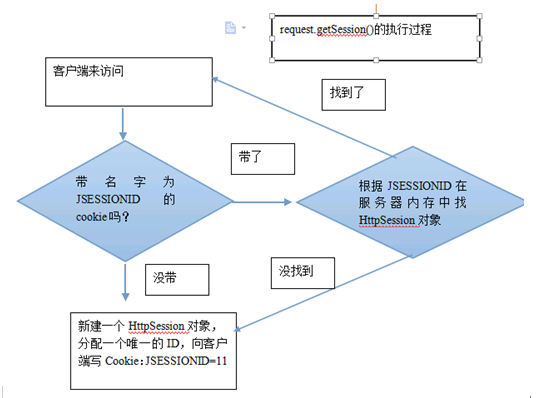
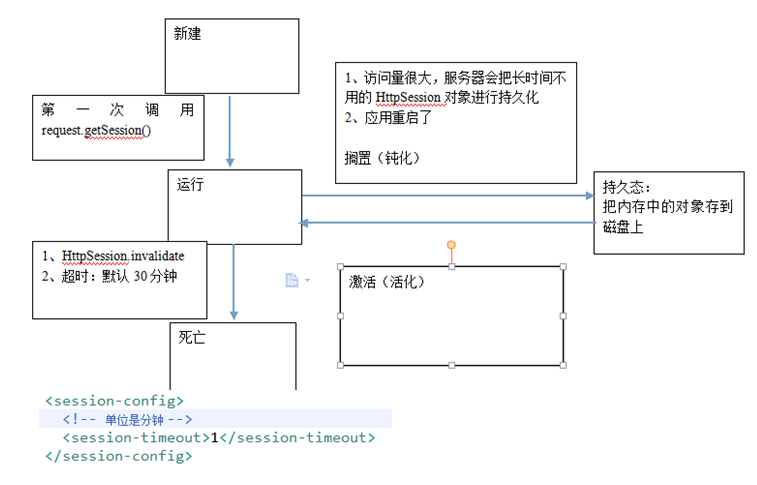
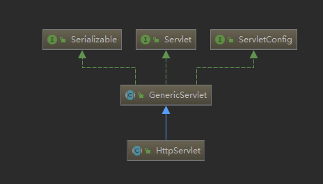

# java web

参考：

[loveincode](https://www.cnblogs.com/loveincode/p/5218060.html#autoid-3-3-0)

## EL表达式

### 运算符

| &nbsp;运算符&nbsp; | 说明     | 范例                                                         | 结果  |
| -------- | -------- | ------------------------------------------------------------ | ----- |
| +        | 加       | ${17+5}                                                      | 22    |
| -        | 减       | ${17-5}                                                      | 12    |
| *        | 乘       | ${17*5}                                                      | 85    |
| /或div   | 除       | ${17/5}或${17 div 5}                                         | 3     |
| %或mod   | 取余     | ${17%5}或${17 mod 5}                                         | 2     |
| ==或eq   | 等于     | ${5==5}或${5 eq 5}                                           | true  |
| !=或ne   | 不等于   | ${5!=5}或${5 ne 5}                                           | false |
| <或lt    | 小于     | ${3<5}或${3 lt 5}                                            | true  |
| >或gt    | 大于     | ${3>5}或${3 gt 5}                                            | false |
| <=或le   | 小于等于 | ${3<=5}或${3 le 5}                                           | true  |
| >=或ge   | 大于等于 | ${3>=5}或${3 ge 5}                                           | false |
| &&或and  | 并且     | ${true&&false}或${true and false}                            | false |
| !或not   | 非       | ${!true}或${not true}                                        | false |
| \|\|或or | 或者     | ${true\|\|false}或${true or false}                           | true  |
| empty    | 是否为空 | ${empty “”}，可以判断字符串、数组、集合的长度是否为0，为0返回true。empty还可以与not或!一起使用。${not empty “”} | true  |

### 操作操作对象的方式

- 操作变量和常量：${name}、${8}；
- 操作List和数组：${list[0]}、${arr[0]}；
- 操作bean的属性：${person.name}、${person[‘name’]}，对应person.getName()方法；
- 操作Map的值：${map.key}、${map[‘key’]}，对应map.get(key)。


## Cookie & Session

先来一个概括

| 方法        | 信息量大小      | 保存时间                                | 应用范围 | 保存位置 |
| ----------- | --------------- | --------------------------------------- | -------- | -------- |
| Application | 任意大小        | 整个应用程序的生命期                    | 所有用户 | 服务器端 |
| Session     | 小量,简单的数据 | 用户活动时间+一段延迟时间(一般为20分钟) | 单个用户 | 服务器端 |
| Cookie      | 小量,简单的数据 | 可以根据需要设定                        | 单个用户 | 客户端   |


### Cookie: 客户端技术

#### HTTP协议的消息头

​	请求消息头：Cookie 客户端向服务器端传递信息

​	响应消息头：Set-Cookie 服务器端向客户端传递信息

#### Cookie详解

1. name：cookie的名称

   1. 必要的属性

2. value：cookie的取值

   1. 必要的属性
   2. **不能为中文**

3. path：cookie的路径

   1. 可选属性

   2. 默认值就是写cookie的那个资源的访问路径

      ```txt
      比如：http://localhost:8080/day09_00_cookie/servlet/CookieDemo1 
      path就是/day09_00_cookie/servlet/
      注意：
      	如果一个存在浏览器缓存中的cookie的路径是/day09/servlet/
      	当访问http://localhost:8080/day09/CookiePathDemo1时，
      	浏览器根本不带Cookie给服务器。浏览器比对的是cookie的路径和当前访问的资源的路径。
      	浏览器满足一下条件就会带cookie给服务器：
      		当前访问的地址的路径.startWith(已存cookie的路径)。即：如果一个Cookie的路径设置为了当前应用，说明访问该网站的任何资源时浏览器都带该cookie给服务器。（开发中经常做的）
      ```

      

4. maxAge：cookie最大生存时间

   1. 默认实在浏览器内存中

5. domain：cookie的域名（网址）

   1. 默认就是cookie的那个资源所属的网站

6. version：版本

7. comment：注释

### Session: 服务端技术

request.getSession()执行流程

1. 有JSESSIONID:
   1. 根据JSESSIONID到服务器内存中找HttpSession对象。
      1. 找到：直接返回HttpSession
      2. 没找到，执行后续
2. 没有JSESSIONID：
   1. 新建HttpSession对象，分配唯一对象，放入内存，返回HttpSession对象。



### HttpSession对象的状态



## Servlet

web容器：页面和服务器的交互桥梁

web.xml 的加载顺序是：context- param -> listener -> filter -> servlet 

实现关系如下：



### 生命周期

```java
//一个Servlet只会有一个对象，服务所有的请求
/*
 * 1.实例化（使用构造方法创建对象）
 * 2.初始化  执行init方法
 * 3.服务     执行service方法
 * 4.销毁    执行destroy方法
 */
public class ServletDemo1 implements Servlet {
     //生命周期方法:当Servlet第一次被创建对象时执行该方法,该方法在整个生命周期中只执行一次
    public void init(ServletConfig arg0) throws ServletException {
                System.out.println("=======init=========");
        }

    //生命周期方法:对客户端响应的方法,该方法会被执行多次，每次请求该servlet都会执行该方法
    public void service(ServletRequest arg0, ServletResponse arg1)
            throws ServletException, IOException {
    }
    //生命周期方法:当Servlet被销毁时执行该方法
    public void destroy() {
        System.out.println("******destroy**********");
    }
//当停止tomcat时也就销毁的servlet。
    public ServletConfig getServletConfig() {
        return null;
    }

    public String getServletInfo() {
        return null;
    }
}
```

### HttpServlet 核心部分

```java
@Override
    protected void doGet(HttpServletRequest req, HttpServletResponse resp)
            throws ServletException, IOException {
        //get方式
        //解决中文乱码
		request.setCharacterEncoding("UTF-8");
        // do something
		response.setContentType("text/html;charset=UTF-8");
    }

    @Override
    protected void doPost(HttpServletRequest req, HttpServletResponse resp)
            throws ServletException, IOException {
        //post方式 do something
    }
```

### 注册

需要在web.xml中注册，tomcator其他服务器才能识别

```xml
<web-app>      
    <servlet>
        <servlet-name>HelloWorld</servlet-name>
        <servlet-class>HelloWorld</servlet-class>
    </servlet>

    <servlet-mapping>
        <servlet-name>HelloWorld</servlet-name>
        <url-pattern>/HelloWorld</url-pattern>
    </servlet-mapping>
</web-app>  
```

## Filter

参考：

<https://www.cnblogs.com/junzi2099/p/8022058.html#_label0>

### 生命周期

基本同servlet，随容器启动和销毁。

启动在servlet之前，销毁在servlet之后。可以理解成包围在servlet外的一层保护。

### 用处

过滤器，可以实现以下目的：（简而言之：对web服务器所管理的资源进行拦截处理）

- 在客户端的请求访问后端资源之前，拦截这些请求。
- 在服务器的响应发送回客户端之前，处理这些响应。

一般用于：

- 身份验证过滤器（Authentication Filters）

- 数据压缩过滤器（Data compression Filters）

- 加密过滤器（Encryption Filters）

- 触发资源访问事件过滤器

- 图像转换过滤器（Image Conversion Filters）

- 日志记录和审核过滤器（Logging and Auditing Filters）

- MIME-TYPE 链过滤器（MIME-TYPE Chain Filters）

- 标记化过滤器（Tokenizing Filters）

- XSL/T 过滤器（XSL/T Filters），转换 XML 内容

- 数据过滤

  - 编码格式转换

  - 日期转换，比如String转Date， Date转String

    

### DEMO

```java
@Override
	protected void doFilterInternal(
			HttpServletRequest request, HttpServletResponse response, FilterChain filterChain)
			throws ServletException, IOException {

		String encoding = getEncoding();
		if (encoding != null) {
			if (isForceRequestEncoding() || request.getCharacterEncoding() == null) {
				request.setCharacterEncoding(encoding);
			}
			if (isForceResponseEncoding()) {
				response.setCharacterEncoding(encoding);
			}
		}
		filterChain.doFilter(request, response);
	}
```


### 注册

配置web.xml

```xml
<filter>
  <filter-name>LogFilter</filter-name>
  <filter-class>com.runoob.test.LogFilter</filter-class>
  <init-param>
    <param-name>Site</param-name>
    <param-value>菜鸟教程</param-value>
  </init-param>
</filter>
<filter-mapping>
  <filter-name>LogFilter</filter-name>
  <url-pattern>/*</url-pattern>
</filter-mapping>
```

## Intercepter

拦截器

是在**面向切面编程**的，就是在你的service或者一个方法，前调用一个方法，或者在方法后调用一个方法，是**基于JAVA的反射机制**。比如动态代理就是拦截器的简单实现，在你调用方法前打印出字符串（或者做其它业务逻辑的操作），也可以在你调用方法后打印出字符串，甚至在你抛出异常的时候做业务逻辑的操作。

servlet、filter、listener是配置到web.xml中（web.xml 的加载顺序是：context-param -> listener -> filter -> servlet ），interceptor不配置到web.xml中，struts的拦截器配置到struts.xml中。spring的拦截器配置到spring.xml中。 

Filter与Interceptor :拦截器是基于Java的反射机制的，而过滤器是基于函数回调。从灵活性上说拦截器功能更强大些，Filter能做的事情，他都能做，而且可以在请求前，请求后执行，比较灵活。Filter主要是针对URL地址做一个编码的事情、过滤掉没用的参数、安全校验（比较泛的，比如登录不登录之类），太细的话，还是建议用interceptor。不过还是根据不同情况选择合适的。

## Listener

监听器

通过listener可以监听web服务器中**某一个执行动作**，并根据其要求作出相应的响应。通俗的语言说就是在**application，session，request**三个对象创建消亡或者往其中添加修改删除属性时自动执行代码的功能组件。比如spring 的总监听器会在服务器启动的时候实例化我们配置的bean对象 、 hibernate 的 session 的监听器会监听session的活动和生命周期，负责创建，关闭session等活动。
Servlet的监听器Listener，它是实现了javax.servlet.ServletContextListener 接口的服务器端程序，它也是随web应用的启动而启动，只初始化一次，随web应用的停止而销毁。主要作用是： 做一些初始化的内容添加工作、设置一些基本的内容、比如一些参数或者是一些固定的对象等等。

```java
	@Override
	public void contextInitialized(ServletContextEvent event) {
		initWebApplicationContext(event.getServletContext());
	}

	@Override
	public void contextDestroyed(ServletContextEvent event) {
		closeWebApplicationContext(event.getServletContext());
		ContextCleanupListener.cleanupAttributes(event.getServletContext());
	}
```

## 总结

### 区别

| Filter                                                       | Interceptor                                                  | Summary                                                      |
| ------------------------------------------------------------ | ------------------------------------------------------------ | ------------------------------------------------------------ |
| Filter 接口定义在 javax.servlet 包中                         | 接口 HandlerInterceptor 定义在org.springframework.web.servlet 包中 |                                                              |
| Filter 定义在 web.xml 中                                     |                                                              |                                                              |
| Filter在只在 Servlet 前后起作用。Filters 通常将 请求和响应（request/response） 当做黑盒子，Filter 通常不考虑servlet 的实现。 | 拦截器能够深入到方法前后、异常抛出前后等，因此拦截器的使用具有更大的弹性。允许用户介入（hook into）请求的生命周期，在请求过程中获取信息，Interceptor 通常和请求更加耦合。 | 在Spring构架的程序中，要优先使用拦截器。**几乎所有 Filter 能够做的事情， interceptor 都能够轻松的实现** |
| Filter 是 Servlet 规范规定的。                               | 而拦截器既可以用于Web程序，也可以用于Application、Swing程序中。 | 使用范围不同                                                 |
| Filter 是在 Servlet 规范中定义的，是 Servlet 容器支持的。    | 而拦截器是在 Spring容器内的，是Spring框架支持的。            | 规范不同                                                     |
| Filter 不能够使用 Spring 容器资源                            | 拦截器是一个Spring的组件，归Spring管理，配置在Spring文件中，因此能使用Spring里的任何资源、对象，例如 Service对象、数据源、事务管理等，通过IoC注入到拦截器即可 | Spring 中使用 interceptor 更容易                             |
| Filter 是被 Server(like Tomcat) 调用                         | Interceptor 是被 Spring 调用                                 |                                                              |

### 执行顺序

过滤前---拦截前---Action处理---拦截后---过滤后