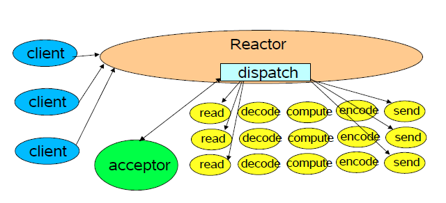

# IO

参考大佬的博客，写得很详细：

<https://www.cnblogs.com/sxkgeek/p/9488703.html>

<https://www.cnblogs.com/restart30/p/8252109.html>

<https://blog.csdn.net/xxb2008/article/details/42424105#>

<https://blog.csdn.net/anxpp/article/details/51512200>    感觉这个代码最贴近现实应用

<http://ifeve.com/overview/>  很全面，很详细

# BIO（同步阻塞 IO）

客户端一个请求对应一个线程。客户端上来一个请求（最开始的连接以及后续的IO请求），服务端新建一个线程去处理这个请求，由于线程总数是有限的（操作系统对线程总数的限制或者线程池的大小），所以，当达到最大值时给客户端的反馈就是无法响应，**阻塞体现在**服务端接收客户端**连接请求**被阻塞了，还有一种阻塞是在单线程处理某一个连接时，需要一直等待IO操作完成。**同步体现在**单个线程处理请求时**调用read（write）**方法需等待读取（写）操作完成才能返回。

## 缺点

1. 默认单线程有阻塞，不支持并发。（**两个阻塞**）

2. 设置成多线程的话，浪费资源。（有多少连接，就需要多少线程，并且大部分只是连接但是不做实际操作）

```java
ServerSocket server = null;
        Socket socket = null;
        InputStream inputStream = null;
        try {
            int port=8008;
            server = new ServerSocket(port);
            System.out.println("wait connection..");
            //一直监听
            while (true){
                 //阻塞一：等待连接   xxx.accept()
                socket = server.accept();
                System.out.println("connected..");
                // 建立好连接后，从socket中获取输入流，并建立缓冲区进行读取
                inputStream = socket.getInputStream();
                byte[] bytes = new byte[1024];
                int len;
                //阻塞二：等待发送内容  xx.read()
                System.out.println("wait data..");
                len = inputStream.read(bytes);
                System.out.println(new String(bytes,0,len, StandardCharsets.UTF_8));
                System.out.println("data accept complete..");
            }
        }
```


# NIO（同步非阻塞 IO）

客户端一个IO请求对应一个线程。过程是这样的，每个客户端一开始上来的连接会注册到selector中，selector会轮询注册上来的连接是否有IO请求，如果有IO请求，就创建一个线程处理该连接上的该次请求。**非阻塞体现在**服务端能够无限量（相对于BIO）的接收客户端的连接请求。**同步体现在**单个线程处理请求时**调用read（write）**方法需等待读取（写）操作完成才能返回。这种模式下，如果后端应用处理遇到资源争夺（数据库操作）而阻塞等，为提高请求的处理速度，可以在后端设立资源池或队列等，把对应的请求数据以及现场（哪个连接的哪个请求等）放入队列，前台线程立即返回处理别的IO请求。

## 改进一：

1. 单线程情况下，解阻塞。ServerSocketChannel
2. 存储链接信息，遍历是否有客户端发送消息

仍然具有缺点：性能瓶颈。连接数量超级多的时候，遍历很费时间。优化方案：由jvm交给os操作系统执行。

```java
int port = 8008;
//类似于ServerSocket，可以解阻塞
ServerSocketChannel server = ServerSocketChannel.open();
//形成端口
SocketAddress socketAddress = new InetSocketAddress(port);
//绑定端口
server.bind(socketAddress);
//设置不会阻塞
server.configureBlocking(false);
while (true){
    //获取消息
    for(SocketChannel socketChannel:list){
        int len = socketChannel.read(byteBuffer);
        //有消息
        if(len>0){
            System.out.println("=====reading"+ len);
            //把消息从buffer中读取到byte
            byteBuffer.flip();
            //注意这里byte的长度不是1024了。而是读取多少，设置多少长度。或者改为一个个字节的读取
            byte[] bytes = new byte[len];
            while (byteBuffer.remaining()>0){
                byteBuffer.get(bytes);
            }
            String message = new String(bytes, StandardCharsets.UTF_8);
            System.out.println(message);
        }else{
            //如果断开连接 应该移除
            //list.remove(socketChannel);
        }
    }
    SocketChannel accept = server.accept();
    //放入list,统一遍历去获取消息
    if(accept!=null){
        System.out.println("========加入一个连接");
        list.add(accept);
    }
}
```

## 改进二：

1. 交给底层操作系统执行（c,c++执行）

   1. 即jni实现了java调用os操作系统函数的功能。 JNI是Java Native Interface的缩写
   2. java关键字：native ，如果有native则会调用操作系统的方法。
   3. 常见的有selector,  epoll。  重点是epoll

2. 注意：不同系统源码不一样。(所以下载的时候才会有版本区分，至少是原因之一吧)

   1. windows版本的java调用的是select

   2. linux版本java调用的是epoll

```java
ServerSocketChannel serverChannel = ServerSocketChannel.open();
// 设置通道为非阻塞
serverChannel.configureBlocking(false);
// 将该通道 对应的ServerSocket绑定到port端口
// 注意：不是绑定ServerSocketChannel，而是绑定其对应的ServerSocket
serverChannel.socket().bind(new InetSocketAddress(port));
// 获得一个通道管理器
Selector selector = Selector.open();
//将通道管理器和该通道绑定，并为该通道注册SelectionKey.OP_ACCEPT事件,注册该事件后，
//当该事件到达时，selector.select()会返回，如果该事件没到达selector.select()会一直阻塞。
serverChannel.register(selector, SelectionKey.OP_ACCEPT);

while (true) {
            //当注册的事件到达时，方法返回；否则,该方法会一直阻塞
            selector.select();
            // 获得selector中选中的项的迭代器，选中的项为注册的事件
            Iterator ite = this.selector.selectedKeys().iterator();
            while (ite.hasNext()) {
                SelectionKey key = (SelectionKey) ite.next();
                // 删除已选的key,以防重复处理
                ite.remove();
                // 客户端请求连接事件
                if (key.isAcceptable()) {
                    ServerSocketChannel server = (ServerSocketChannel) key.channel();
                    // 获得和客户端连接的通道：真正和客户端通信的通道
                    // 完成该操作意味着完成TCP三次握手，TCP物理链路正式建立
                    SocketChannel responeceChannel = server.accept();
                    // 设置成非阻塞
                    responeceChannel.configureBlocking(false);
                    responeceChannel.register(this.selector, SelectionKey.OP_READ);
                    // 获得了可读的事件
                } else if (key.isReadable()) {
                    System.out.println("===========read key:"+key);
                    SocketChannel channel = (SocketChannel) key.channel();
                    // 创建读取的缓冲区
                    ByteBuffer buffer = ByteBuffer.allocate(512);
                    StringBuilder sb = new StringBuilder();
                    //如果长度超过byteBuffer一次性读取完
                    while ( channel.read(buffer)>0){
                        buffer.flip();
                        sb.append(new String(buffer.array())).append("+");
                    }
                    System.out.println("received : " + sb.toString());
                 }
             }
        }
```

​      

## NIO方法

### ServerSocketChannel

类似于ServerSocket，重点在于提供了非阻塞的方法。configureBlocking(false).则建立的连接不是阻塞的

### SocketChannel

类似于Socket。用于客户端和服务器端的交互。

并且区别在于socket通过获取inputStream和outputStream来实现交互（理解成单向的），

但是SocketChannel是双向的。可以并且只能通过xxxBuffer实现读写。

ByteBuffer我理解的是一个容器类。里面有一个很有意思的方法：flip，用于切换读写状态。

```java

```

# AIO（NIO2：异步非阻塞IO）

客户端一个IO请求对应一个线程。

过程同NIO，只是在读写IO时略有差异，对于read，方法调用后会立即返回，返回对应中有个回调方法，调用时java会告知操作系统缓冲区大小以及地址，操作系统把流里面的内容读入缓冲区后回调刚刚read返回的回调方法。对应write，方法调用后会立即返回，返回对应中有个回调方法，调用时将数据放入缓存区，操作系统往流里面写完数据后同样会回调刚刚write返回的回调方法。

**阻塞是因为此时是通过select系统调用来完成的，而select函数本身的实现方式是阻塞的，而采用select函数有个好处就是它可以同时监听多个文件句柄，从而提高系统的并发性**请求。

**异步步体现在**单个线程处理请求时**调用read（write）**方法会立即返回，返回对象有回调方法，底层OS完成IO操作后会回调该方法。

## 异步主要体现

- AsynchronousSocketChannel
  - 类似SocketChannel
- AsynchronousServerSocketChannel
  - 类似ServerSocketChannel
- AsynchronousFileChannel
- AsynchronousDatagramChannel

在AIO socket编程中，服务端通道是AsynchronousServerSocketChannel，这个类提供了一个open()静态工厂，一个bind()方法用于绑定服务端IP地址（还有端口号），另外还提供了accept()用于接收用户连接请求。在客户端使用的通道是AsynchronousSocketChannel,这个通道处理提供open静态工厂方法外，还提供了read和write方法。

在AIO编程中，发出一个事件（accept read write等）之后要指定事件处理类（回调函数），AIO中的事件处理类是CompletionHandler<V,A>，这个接口定义了如下两个方法，分别在异步操作成功和失败时被回调。

void completed(V result, A attachment);

void failed(Throwable exc, A attachment);

## demo

### 开启和绑定

```java
AsynchronousServerSocketChannel serverChannel;
serverChannel = AsynchronousServerSocketChannel.open().bind(new InetSocketAddress(port), 100);	//port是端口号
serverChannel.accept(this, new AcceptHandler());	//new AcceptHandler是实现的具体回调
```


**回调方法需要具体实现**

### accept回调

```java
    /**
     * accept到一个请求时的回调
     */
private class AcceptHandler implements CompletionHandler<AsynchronousSocketChannel, AIOServer> {
        @Override
        public void completed(final AsynchronousSocketChannel client, AIOServer attachment) {
            try {
                System.out.println("远程地址：" + client.getRemoteAddress());
                //tcp各项参数
                client.setOption(StandardSocketOptions.TCP_NODELAY, true);
                client.setOption(StandardSocketOptions.SO_SNDBUF, 1024);
                client.setOption(StandardSocketOptions.SO_RCVBUF, 1024);

                if (client.isOpen()) {
                    System.out.println("client.isOpen：" + client.getRemoteAddress());
                    final ByteBuffer buffer = ByteBuffer.allocate(BUFFER_SIZE);
                    buffer.clear();
                    client.read(buffer, client, new ReadHandler(buffer));
                }

            } catch (Exception e) {
                e.printStackTrace();
            } finally {
                attachment.serverChannel.accept(attachment, this);// 监听新的请求，递归调用。
            }
        }

        @Override
        public void failed(Throwable exc, AIOServer attachment) {
            try {
                exc.printStackTrace();
            } finally {
                attachment.serverChannel.accept(attachment, this);// 监听新的请求，递归调用。
            }
        }
    }
```


### read回调

```java
    /**
     * Read到请求数据的回调
     */
    private class ReadHandler implements CompletionHandler<Integer, AsynchronousSocketChannel> {

        private ByteBuffer buffer;

        public ReadHandler(ByteBuffer buffer) {
            this.buffer = buffer;
        }

        @Override
        public void completed(Integer result, AsynchronousSocketChannel attachment) {
            try {
                if (result < 0) {// 客户端关闭了连接
                    AIOServer.close(attachment);
                } else if (result == 0) {
                    System.out.println("空数据"); // 处理空数据
                } else {
                    // 读取请求，处理客户端发送的数据
                    buffer.flip();
                    CharBuffer charBuffer = AIOServer.decoder.decode(buffer);
                    System.out.println(charBuffer.toString()); //接收请求

                    //响应操作，服务器响应结果
                    buffer.clear();
                    String res = "HTTP/1.1 200 OK" + "\r\n\r\n" + "hellworld";
                    buffer = ByteBuffer.wrap(res.getBytes());
                    attachment.write(buffer, attachment, new WriteHandler(buffer));//Response：响应。
                }
            } catch (Exception e) {
                e.printStackTrace();
            }
        }

        @Override
        public void failed(Throwable exc, AsynchronousSocketChannel attachment) {
            exc.printStackTrace();
            AIOServer.close(attachment);
        }
    }
```

### write回调

```java
    /**
     * Write响应完请求的回调
     */
    private class WriteHandler implements CompletionHandler<Integer, AsynchronousSocketChannel> {
        private ByteBuffer buffer;

        public WriteHandler(ByteBuffer buffer) {
            this.buffer = buffer;
        }

        @Override
        public void completed(Integer result, AsynchronousSocketChannel attachment) {
            buffer.clear();
            AIOServer.close(attachment);
        }

        @Override
        public void failed(Throwable exc, AsynchronousSocketChannel attachment) {
            exc.printStackTrace();
            AIOServer.close(attachment);
        }
    }
```


# NETTY

## 参考

[netty介绍](https://www.jianshu.com/p/40a2004a531b)

[netty概述](https://www.jianshu.com/p/1a6d1a25e6cc)

[reactor模式](https://www.jianshu.com/p/eef7ebe28673)

[新手入门](https://www.cnblogs.com/imstudy/p/9908791.html)	《**重点推荐**》

[源码进阶](https://www.cnblogs.com/crazymakercircle/tag/netty/)

## 优点

1. 设计优雅：适用于各种传输类型的统一 API 阻塞和非阻塞 Socket；基于灵活且可扩展的事件模型，可以清晰地分离关注点；高度可定制的线程模型 - 单线程，一个或多个线程池；真正的无连接数据报套接字支持（自 3.1 起）。

2. 使用方便：详细记录的 Javadoc，用户指南和示例；没有其他依赖项，JDK 5（Netty 3.x）或 6（Netty 4.x）就足够了。

3. 高性能、吞吐量更高：延迟更低；减少资源消耗；最小化不必要的内存复制。

4. 安全：完整的 SSL/TLS 和 StartTLS 支持。、

## 使用场景

1. 互联网行业：在分布式系统中，各个节点之间需要远程服务调用，高性能的 RPC 框架必不可少，Netty 作为异步高性能的通信框架，往往作为基础通信组件被这些 RPC 框架使用。典型的应用有：阿里分布式服务框架 Dubbo 的 RPC 框架使用 Dubbo 协议进行节点间通信，Dubbo 协议默认使用 Netty 作为基础通信组件，用于实现各进程节点之间的内部通信。

2. 游戏行业：无论是手游服务端还是大型的网络游戏，Java 语言得到了越来越广泛的应用。Netty 作为高性能的基础通信组件，它本身提供了 TCP/UDP 和 HTTP 协议栈。

3. 非常方便定制和开发私有协议栈，账号登录服务器，地图服务器之间可以方便的通过 Netty 进行高性能的通信。

4. 大数据领域：经典的 Hadoop 的高性能通信和序列化组件 Avro 的 RPC 框架，默认采用 Netty 进行跨界点通信，它的 Netty Service 基于 Netty 框架二次封装实现。

   

## Reactor模式

使用netty，不得不了解reactor模式（别问我为什么知道 = =）

在处理web请求时，通常有两种体系结构，分别为：thread-based architecture（基于线程）、event-driven architecture（事件驱动）

## 高性能设计

Netty 作为异步事件驱动的网络，高性能之处主要来自于其 I/O 模型和线程处理模型，前者决定如何收发数据，后者决定如何处理数据

### I/O 模型

### 线程处理模型

#### thread-based architecture

基于线程的体系结构通常会使用多线程来处理客户端的请求，每当接收到一个请求，便开启一个独立的线程来处理。

请求很多的时候，线程开销很大。造成服务器负担


#### event-driven architecture

事件驱动体系结构是目前比较广泛使用的一种。这种方式会定义一系列的事件处理器来响应事件的发生，并且将服务端接受连接与对事件的处理分离。其中，事件是一种状态的改变。比如，tcp中socket的new incoming connection、ready for read、ready for write。



#### reactor

reactor设计模式是event-driven architecture的一种实现方式，处理多个客户端并发的向服务端请求服务的场景。每种服务在服务端可能由多个方法组成。reactor会解耦并发请求的服务并分发给对应的事件处理器来处理。目前，许多流行的开源框架都用到了reactor模式，如：netty、node.js等，包括java的nio。


## netty架构


## 模块组件

### Bootstrap、ServerBootstrap

Bootstrap 类是客户端程序的启动引导类，ServerBootstrap 是服务端启动引导类

### Channel和Pipeline

Netty 网络通信的组件，能够用于执行网络 I/O 操作

提供一下channel类型：

```txt
NioSocketChannel，异步的客户端 TCP Socket 连接。
NioServerSocketChannel，异步的服务器端 TCP Socket 连接。
NioDatagramChannel，异步的 UDP 连接。
NioSctpChannel，异步的客户端 Sctp 连接。
NioSctpServerChannel，异步的 Sctp 服务器端连接，这些通道涵盖了 UDP 和 TCP 网络 IO 以及文件 IO。
```

在 Netty 中每个 Channel 都有且仅有一个 ChannelPipeline 与之对应，它们的组成关系如下：


ChannelPipeline是一个双向链表。入站事件会从链表 head 往后传递到最后一个入站的 handler，出站事件会从链表 tail 往前传递到最前一个出站的 handler，两种类型的 handler 互不干扰。

### HandlerAdapter适配器

```text
ChannelInboundHandlerAdapter 用于处理入站 I/O 事件。
ChannelOutboundHandlerAdapter 用于处理出站 I/O 操作。
ChannelDuplexHandler 用于处理入站和出站事件。
```

### Selector

Netty 基于 Selector 对象实现 I/O 多路复用，通过 Selector 一个线程可以监听多个连接的 Channel 事件。

当向一个 Selector 中注册 Channel 后，Selector 内部的机制就可以自动不断地查询(Select) 这些注册的 Channel 是否有已就绪的 I/O 事件（例如可读，可写，网络连接完成等），这样程序就可以很简单地使用一个线程高效地管理多个 Channel 。

### ByteBuf

对比NIO.ByteBuffer的优势：

1. Pooling (池化，这点减少了内存复制和GC，提升效率)
2. 可以自定义缓冲类型
3. 通过一个内置的复合缓冲类型实现零拷贝
4. 扩展性好，比如 StringBuffer
5. 不需要调用 flip()来切换读/写模式
6. 读取和写入索引分开
7. 方法链
8. 引用计数


#### 创建和释放

**原理**：通过release方法减去 heapBuffer 的使用计数，Netty 会自动回收 heapBuffer

##### 手动获取与释放ByteBuf

获取Java 堆中的缓冲区

```java
ByteBuf heapBuffer = ctx.alloc().heapBuffer();
```

释放缓冲区（不管手动还是自动，其原理都是release）

```java
ReferenceCountUtil.release(heapBuffer );
```


##### 自动获取和释放 ByteBuf

###### 方式一：TailHandler 自动释放

###### 方式二：SimpleChannelInboundHandler 自动释放

###### 方式三：HeadHandler 自动释放

##### 总结

1. 入站处理流程中，如果对原消息不做处理，默认会调用 ctx.fireChannelRead(msg) 把原消息往下传，由流水线最后一棒 TailHandler 完成自动释放。
2. 如果将原消息转化为新的消息并调用 ctx.fireChannelRead(newMsg)往下传，那必须把原消息release掉。
3. 或者是继承SimpleChannelInboundHandler自动处理。
4. 出站处理过程中，申请分配到的 ByteBuf，通过 HeadHandler 完成自动释放。
5. 多层的异常处理机制，有些异常处理的地方不一定准确知道ByteBuf之前释放了没有，可以在释放前加上引用计数大于0的判断避免异常；
6. 总之，**只要是在传递过程中，没有传递下去的ByteBuf就需要手动释放，避免不必要的内存泄露**。

#### 缓冲区 Allocator 分配器

Netty提供了ByteBufAllocator的两种实现：PoolByteBufAllocator和UnpooledByteBufAllocator。前者将ByteBuf实例放入池中，提高了性能，将内存碎片减少到最小。这个实现采用了一种内存分配的高效策略，称为 **jemalloc**。它已经被好几种现代操作系统所采用。后者则没有把ByteBuf放入池中，每次被调用时，返回一个新的ByteBuf实例

#### 缓冲区内存的类型

| 使用模式   | 描述                                                         | 优点                                                      | 劣势                                                         |
| ---------- | ------------------------------------------------------------ | --------------------------------------------------------- | ------------------------------------------------------------ |
| 堆缓冲区   | 数据存存储在JVM的堆空间中，又称为支撑数组，通过 hasArray 来判断是不是在堆缓冲区中 | 没使用池化情况下能提供快速的分配和释放                    | 发送之前都会拷贝到直接缓冲区                                 |
| 直接缓冲区 | 存储在物理内存中                                             | 能获取超过jvm堆限制大小的空间； 写入channel比堆缓冲区更快 | 释放和分配空间昂贵(使用系统的方法) ； 操作时需要复制一次到堆上 |
| 复合缓冲   | 单个缓冲区合并多个缓冲区表示                                 | 操作多个更方便                                            | -                                                            |

使用：

```java
//创建复合缓冲区
CompositeByteBuf compBuf = Unpooled.compositeBuffer();
//创建堆缓冲区
ByteBuf heapBuf = Unpooled.buffer(8);
//创建直接缓冲区
ByteBuf directBuf = Unpooled.directBuffer(16);
```

#### ByteBuf 的四个逻辑部分

第一个部分是已经丢弃的字节，这部分数据是无效的；

第二部分是可读字节，这部分数据是 ByteBuf 的主体数据， 从 ByteBuf 里面读取的数据都来自这一部分;

第三部分的数据是可写字节，所有写到 ByteBuf 的数据都会写到这一段。

第四部分的字节，表示的是该 ByteBuf 最多还能扩容的大小。


#### ByteBuf 的三个指针

- readerIndex（读指针）

  每读取一个字节，readerIndex 自增1 。一旦 readerIndex 与 writerIndex 相等，ByteBuf 不可读 。

- writerIndex（写指针）

  每写一个字节，writerIndex 自增1。一旦增加到 writerIndex 与 capacity（） 容量相等，表示 ByteBuf 已经不可写了

- maxCapacity（最大容量）

  指示可以 ByteBuf 扩容的最大容量。当向 ByteBuf 写数据的时候，如果容量不足，可以进行扩容。

  capacity（）扩容超过最大限度 maxCapacity 就会报错


#### ByteBuf 的引用计数

如果计数为0，则需要看是pooled还是Unpooled，如果是pool则放入池子，反之由GC回收。

- 默认情况下，当创建完一个 ByteBuf 时，它的引用为1
- 每次调用 retain()方法， 它的引用就加 1 
- 每次调用 release() 方法，是将引用计数减 1

#### ByteBuf 的浅层复制

ByteBuf 的浅层复制分为两种，有切片slice 浅层复制，和duplicate 浅层复制。

​	slice 只copy可读部分

​	duplicate copy全部

##### slice 切片浅层复制

```java
public static void testSlice() {
    ByteBuf buffer = ByteBufAllocator.DEFAULT.buffer(9, 100);
    print("===allocate ByteBuf(9, 100)===", buffer);

    buffer.writeBytes(new byte[]{1, 2, 3, 4});
    print("===writeBytes(1,2,3,4)===", buffer);

    ByteBuf buffer1= buffer.slice();
    print("===buffer slice===", buffer1);
}
```

输出：

```java
===========allocate ByteBuf(9, 100)============
capacity(): 9
maxCapacity(): 100
readerIndex(): 0
readableBytes(): 0
isReadable(): false
writerIndex(): 0
writableBytes(): 9
isWritable(): true
maxWritableBytes(): 100

===========writeBytes(1,2,3,4)============
capacity(): 9
maxCapacity(): 100
readerIndex(): 0
readableBytes(): 4
isReadable(): true
writerIndex(): 4
writableBytes(): 5
isWritable(): true
maxWritableBytes(): 96

===========buffer slice============
capacity(): 4
maxCapacity(): 4
readerIndex(): 0
readableBytes(): 4
isReadable(): true
writerIndex(): 4
writableBytes(): 0
isWritable(): false
maxWritableBytes(): 0
```


##### duplicate() 浅层复制


## 工作架构图


BossGroup NioEventLoop 循环执行的任务包含 3 步：

1）轮询 Accept 事件；

2）处理 Accept I/O 事件，与 Client 建立连接，生成 NioSocketChannel，并将 NioSocketChannel 注册到某个 Worker NioEventLoop 的 Selector 上；

3）处理任务队列中的任务，runAllTasks。任务队列中的任务包括用户调用 eventloop.execute 或 schedule 执行的任务，或者其他线程提交到该 eventloop 的任务。

WorkerGroup NioEventLoop 循环执行的任务包含 3 步：

1）轮询 Read、Write 事件；

2）处理 I/O 事件，即 Read、Write 事件，在 NioSocketChannel 可读、可写事件发生时进行处理；

3）处理任务队列中的任务，runAllTasks。


# 通信协议（补充知识）

## TCP

### 优点：

 可靠，稳定 TCP的可靠体现在TCP在传递数据之前，会有三次握手来建立连接，而且在数据传递时，有确认、窗口、重传、拥塞控制机制，在数据传完后，还会断开连接用来节约系统资源。 

### 缺点： 

慢，效率低，占用系统资源高，易被攻击 TCP在传递数据之前，要先建连接，这会消耗时间，而且在数据传递时，确认机制、重传机制、拥塞控制机制等都会消耗大量的时间，而且要在每台设备上维护所有的传输连接，事实上，每个连接都会占用系统的CPU、内存等硬件资源。 而且，因为TCP有确认机制、三次握手机制，这些也导致TCP容易被人利用，实现DOS、DDOS、CC等攻击。

### 使用场景：

当对网络通讯质量有要求的时候，比如：整个数据要准确无误的传递给对方，这往往用于一些要求可靠的应用，比如HTTP、HTTPS、FTP等传输文件的协议，POP、SMTP等邮件传输的协议。 在日常生活中，常见使用TCP协议的应用如下： 浏览器，用的HTTP FlashFXP，用的FTP Outlook，用的POP、SMTP Putty，用的Telnet、SSH QQ文件传输 ………… 

## UDP

### 优点：

快，比TCP稍安全 UDP没有TCP的握手、确认、窗口、重传、拥塞控制等机制，UDP是一个无状态的传输协议，所以它在传递数据时非常快。没有TCP的这些机制，UDP较TCP被攻击者利用的漏洞就要少一些。但UDP也是无法避免攻击的，比如：UDP Flood攻击

### 缺点：

 不可靠，不稳定 因为UDP没有TCP那些可靠的机制，在数据传递时，如果网络质量不好，就会很容易丢包。

### 使用场景：

当对网络通讯质量要求不高的时候，要求网络通讯速度能尽量的快，这时就可以使用UDP。 比如，日常生活中，常见使用UDP协议的应用如下： QQ语音 QQ视频 TFTP

## RTP

是用于Internet上针对多媒体数据流的一种传输层协议。它是建立在 UDP 协议上的.
RTP 不像http和ftp可完整的下载整个影视文件，它是以固定的数据率在网络上发送数据，客户端也是按照这种速度观看影视文件，当影视画面播放过后，就不可以再重复播放

## RTCP

## RTSP

RTSP 是一种双向实时数据传输协议，它允许客户端向服务器端发送请求，如回放、快进、倒退等操作

## WebRTC

## RTMP(Real Time Messaging Protocol)

基于TCP不会丢失

## HLS

HLS 点播，基本上就是常见的分段HTTP点播，不同在于，它的分段非常小