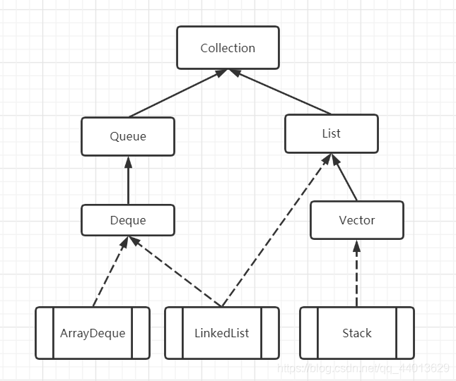
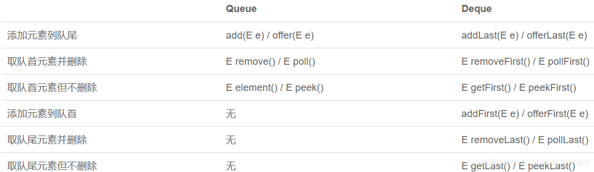

# Java基础

## Dequeue

既能实现栈，又能实现队列的数据结构。

### **与Queue的区别**

### 实现队列和栈

**栈**

| 操作     | 方法                                                    |
| -------- | ------------------------------------------------------- |
| 入栈     | push(E e)                                               |
| 出栈     | poll() / pop() 后者在栈空的时候会抛出异常，前者返回null |
| 查看栈顶 | peek() 为空时返回null                                   |

**队列**

| 操作     | 方法                  |
| -------- | --------------------- |
| 入队     | offer(E e)            |
| 出队     | poll() 为空时返回null |
| 查看队首 | peek() 为空时返回null |

### Queue的常用操作

add         增加一个元索                      如果队列已满，则抛出一个IIIegaISlabEepeplian异常
remove   移除并返回队列头部的元素     如果队列为空，则抛出一个NoSuchElementException异常
element  返回队列头部的元素              如果队列为空，则抛出一个NoSuchElementException异常
offer       添加一个元素并返回true        如果队列已满，则返回false
poll         移除并返问队列头部的元素     如果队列为空，则返回null
peek       返回队列头部的元素              如果队列为空，则返回null
put         添加一个元素                       如果队列满，则阻塞
take        移除并返回队列头部的元素     如果队列为空，则阻塞

广度优先搜索算法：

核心思想：队列存储数据，先入先出。

1、先搜索一度关系，再搜索二度关系。

2、新建队列：一度关系入列。

3、检查是否符合，若不符合，则标记检查过，然后将其二度关系加入队列。

4、继续检查队列中下一个

。。。。。

