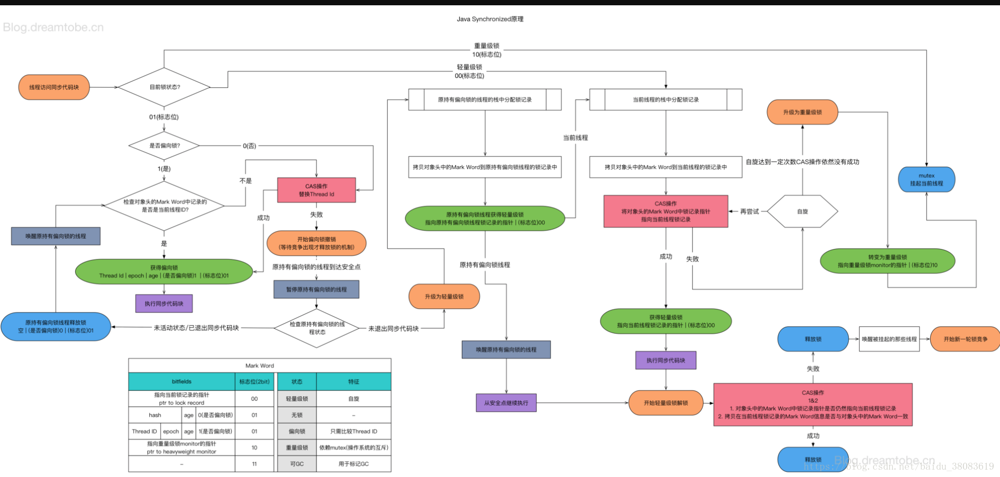

# JMM

java内存模型：**Java Memory Model**

## 锁的升级过程

下图是JVM内存结构（hotspot）

64位 = 8个字节。markword里面。

**synchronized是Java内置的机制，是JVM层面的，而Lock则是接口，是JDK层面的**

由于线程竞争导致synchronized锁的升级：无锁(01)--》偏向锁(01)--》轻量级锁(00)--》重量级锁(10)

锁一旦升级就**不能降级了**。




synchronize加锁的底层其实就是两个代码：(但是更底层还是 lock cmpxchg)

1. monitorEnter
2. monitorExit


## 对象在内存中的布局


关于锁的记录信息记录在markword里面。


问：new Object()在内存中占多少个字节？

答：

```txt
markword：一般是8个字节。（64位）

class pointer：开启压缩是4字节，未开启是8字节。默认开启。则为4.

instance data：实例数据占用大小。new Object() 无成员变量 ，所以为0。

padding：需要被8整除， 12不够，所以需要补齐，最少需要4字节。所以padding为4.

综上：  new Object()占16个字节。

```


## 内存屏障

屏障两边的指令禁止重排。比如写的时候禁止读，反之亦然。因此这个功能保证了数据的一致性。

```java
//写入的时候，增加内存屏障
StoreStoreBarrier
volatile 写操作
StoreLoadBarrier

//读取的时候，增加内存屏障
LoadLoadBarrier
volatitle读操作
LoadStoreBarrier
```


单例模式下，double check需要volatile吗？ 需要，防止重排序 。

# JVM

java虚拟机：

java virtual machine


内存模型：方法区，堆，(线程)栈，本地方法栈，程序计数器

jdk自带反汇编

javap -c xxx.class

程序计数器：主要作用在多线程情况下标记程序执行到的位置

字节码执行引擎：修改程序计数器的值


## 栈

FILO  先入后出，main最开始执行，最后执行完毕。

### 栈帧：

#### 局部变量表

存放局部变量的值

#### 操作数栈

临时内存区域

#### 动态连接

#### 方法出口

​	方法返回到哪个位置，由程序计数器决定

## 堆

### 内存空间结构

名称：年轻代：老年代

内存占比：	1/3： 2/3

#### 年轻代

进一步分为：Eden， Servivor区 (分为s0, s1)

内存占比：   8/10， 1/10，   1/10	

年轻代的Eden内存满了触发minor GC。

#### 老年代

每一次minor GC扫描发现有引用，则对象头的对象分代年龄+1；如果达到15，则放入老年代。minor GC不会扫描。

老年代内存满了触发full GC。


## GC

当堆内存满了，则自动触发GC，回收内存空间

### GC root

可达性算法。

一系列的链表结构，用来判别是否有引用。如果没有引用则会被视为垃圾，从而回收掉。

### minor GC

检查eden区域，servivor区域。

常用的判断方法有可达性算法，标记有引用的内存区域，其他没有用的就清除掉。

eden中有引用的挪到servivor（具体是s0,还是s1看当前位置）

s0有引用的挪到s1（交替，始终保持一个是空的。比如此时在s1，s0是空的，则把s1还在引用的，和eden中有引用的挪到s0, 对象分代年龄计数+1）

### full GC

当老年代内存占满的时候，触发全体清空，清空年轻代+老年代。

如果回收失败，则抛出异常OutOfMemery。  oom

比如在局部方法里面，无限次new对象，引用对象。常见的有递归。


### STW

full GC的时候会将用户线程挂载起来，去进行fullGC, 所以用户会感觉到卡顿。但是通常GC操作非常快。

我们称这个卡顿为STW（stop the world）

- 为什么需要STW,  单线程GC操作去遍历GCroot更快，保证之前扫描过的数据是正确的，而不是时刻变化的。
- 为什么需要jvm调优，就是优化full GC，去减少STW的时间，增强用户体验。


## JVM调优概念

需要具体场景具体分析，比如电商系统，下单之后产生很多没用的对象。就应该适当增加年轻代的空间，减少老年代的空间。

java自带jvm调优监控工具：jvisualvm.exe

### 类加载机制

1. 加载：
   1. 全盘负责委托机制：Class.forName("xxxx");
   2. 双亲委派机制：ClassLoader.loadClass("xxx");
2. 验证
3. 准备：分配内存
4. 解析：符号引用替换成直接引用
5. 初始化：赋值为期望的值。比如int i = 5.一开始i=0,初始化才变成5
6. 使用
7. 卸载

#### 


### 垃圾回收算法

#### 引用计数法

有引用则+1，为0代表可以用被回收。

- 优点：简单

- 缺点：

  <1>计数器值的增减处理非常繁重

  <2>计算器需要占用很多位。

  <3>实现繁琐。

  <4>循环引用无法回收。

#### 标记-清除算法

分为标记+清除 两个阶段。先做标记，然后统一清除（应该是定时清除或者达到多少比例后清除）。

- 缺点：

  <1>碎片化（内存中一个对象的使用是需要连续的。则造成了内存的浪费）

  <2>分配速度：因为分块不是连续的，因此每次分块都要遍历空闲链表，找到足够大的分块，从而造成时间的浪费

  <3>实现繁琐。

#### 复制算法

（年轻代中Servivor区使用的算法，s0-s1）

对标记-清除算法的一种改进。解决了碎片化问题。

将内存空间按容量分成两块。当这一块内存用完的时候，将还存活着的对象复制到另外一块，然后完全清除掉之前的内存。

- 优点：解决了标记-清除算法的缺点
- 缺点：堆的利用率低下（因为有一半没有使用）

#### 标记-整理算法

(年轻代中eden区域使用的算法)

类似于标记-清除算法。只不过最后清除的时候重新排列了一下。避免了碎片化。

- 缺点：排列比较费时间。

#### 分代收集算法

（很多算法的集合）

即分为新生代，老年代。然后各个块里面可以使用不同的算法混合使用。使效率达到最高。（扬长补短）

### 垃圾收集器

常见7中收集器。

<https://blog.csdn.net/hellozhxy/article/details/93647196>

#### 新生代收集器

- Serial收集器
- ParNew 收集器
- Parallel Scavenge 收集器

#### 老年代收集器

- Serial Old收集器
- Parallel Old收集器
- CMS收集器
- G1收集器

#### 总结

| 收集器                | 串行、并行or并发 | 新生代/老年代 | 算法               | 目标         | 适用场景                                  |
| :-------------------- | :--------------- | :------------ | :----------------- | :----------- | :---------------------------------------- |
| Serial                | 串行             | 新生代        | 复制算法           | 响应速度优先 | 单CPU环境下的Client模式                   |
| Serial Old            | 串行             | 老年代        | 标记-整理          | 响应速度优先 | 单CPU环境下的Client模式、CMS的后备预案    |
| ParNew                | 并行             | 新生代        | 复制算法           | 响应速度优先 | 多CPU环境时在Server模式下与CMS配合        |
| **Parallel Scavenge** | 并行             | 新生代        | 复制算法           | 吞吐量优先   | 在后台运算而不需要太多交互的任务          |
| Parallel Old          | 并行             | 老年代        | 标记-整理          | 吞吐量优先   | 在后台运算而不需要太多交互的任务          |
| CMS                   | 并发             | 老年代        | 标记-清除          | 响应速度优先 | 集中在互联网站或B/S系统服务端上的Java应用 |
| **G1**（官方推荐）    | 并发             | both          | 标记-整理+复制算法 | 响应速度优先 | 面向服务端应用，将来替换CMS               |

## JVM调优步骤

1. 打印GC日志

   ```java
   -XX:+PrintGC 输出GC日志
   -XX:+PrintGCDetails 输出GC的详细日志
   -XX:+PrintGCTimeStamps 输出GC的时间戳（以基准时间的形式）
   -XX:+PrintGCDateStamps 输出GC的时间戳（以日期的形式，如 2013-05-04T21:53:59.234+0800）
   -XX:+PrintHeapAtGC 在进行GC的前后打印出堆的信息
   -Xloggc:../logs/gc.log 日志文件的输出路径
   ```

2. 分析日志：有了日志文件之后，可以借助市面上的分析工具进行可视化的分析。比如GC easy

3. 调整JVM参数

## 强/弱/虚/幻想引用

对象存活周期： 强 > 弱 > 虚 > 幻想

### 强引用

如Object obj = new Object();

内存不够了，也不会让GC回收，宁愿抛错OOM(out of memery)

### 弱引用

SoftReference

当内存空间足够的时候，垃圾回收器不会回收它；不够的时候会选择牺牲一部分。

```java
Object obj = new Object();
SoftReference<Object> sf = new SoftReference<Object>(obj);
obj = null;
```


### 虚引用

WeakReference

作用：NIO中有一个zeroCopy， 管理堆外内存。

不管内存是否足够，GC都会回收

```java
Object obj = new Object();
WeakReference<Object> wf = new WeakReference<Object>(obj);
obj = null;
//有时候会返回null
wf.get();
//返回是否被垃圾回收器标记为即将回收的垃圾
wf.isEnQueued();
```


聚集索引：：索引和数据存储在一起，即key对应的value就是用户想要的值。

非聚集索引：索引和数据分开存储，即key对应的value存的是地址，另一个文件里面去根据值找


聚集索引的好处是减少磁盘交互，减少查询时间。增加查询效率。虽然都是B+Tree的存储方式，但是非聚集索引找到存储的位置之后还需要到另一个文件去找对应的value，而聚集索引直接就把key对应的value拿出来了


主键索引推荐自增，而且是整型的原因是 减少分裂的情况。因为如果没有按顺序插入，那么会给b+tr


# HashMap

## java7

数组+链表

Object.hashcode() % 16 = [0,15] //落在0-15这个数组中的一个坑位上

//但是实际是位运算 hash & (length -1) 效率远远高于%

如果有重叠，则产生hash碰撞，产生链表，并且**头部插入链表

缺陷：多线程情况下，扩容（resize），会导致死循环。（就是链表的死循环，A指B，B指向A）

java7中只声明了两个变量：低位和高位。

## java8

数组+链表+红黑树

### resize做了优化

声明4个变量避免了死循环：分别是低位的头尾，和高位的头尾。 Node<k,v> loHead, loTail,      Node<K,V>   hiHead, hiTail

& （2^N  ）的结果肯定是 0 或者 !=0     （0001000= 16）  0和任何值&的结果肯定是0

### 加入红黑树

链表过长转换成红黑树存储。

情况一：数组长度小于64，即使链表长度>=8也不转红黑树，而是优先扩容

情况二：数组长度>=64，链表长度>=8，则链表转红黑树


### 扩容为什么是2的次方？

初始化容量：默认16

扩容：2^n  （2,4,8,16,32.....）  因为扩容是采用位运算进行的。进或退都是2的次方。


### 为什么是0.75？

负载因子：Default_Load_Factor = 0.75f

因为从时间和空间上的平衡点，实际是0.693左右，但是为了计算方便取的0.75 。牛顿二项等式。

如果是1，则代表放满的时候才扩容，但是不可能100%放满，很容易产生hash碰撞，所以结果就是产生了很多链表才扩容

如果是0.5，则代表占一半的时候就扩容，很浪费物理空间。

扩容的时候，可以很好的解决以前的链表过长的情况，均匀拆分链表到其他的数组上去。（比如原本占一个坑的一个链表是长度为8，扩容后就变成了两个链表长度分别是4占了两个坑）


# 线程

## 线程周期

- 新建
- 就绪
- 运行
- 等待
- 消亡


## 线程池周期

- Running：能接受新任务以及处理已添加的任务
- Shutdown：不接受新任务，可以处理已添加的任务
- Stop：不接受新任务，不处理已添加的任务，并且中断正在处理的任务
- Tidying：所有任务已终止，ctl记录的任务数量为0（ctl负责记录线程池状态和活动线程数量）
- Terminated：线程池彻底终止，则线程池转变为terminated状态


new ThreadPoolExecutor(core,max,time,timeUnit,arrayBlockingQueue, factory)

core：核心线程数量，即正式工

max：最大线程数量，core+ 临时工

time：超过多少时间后销毁（无线程调度开始计算）

unit：单位，默认毫秒？

注意：并不是和核心线程用完了就直接创建临时线程，而是加入队列中，如果队列满了还不够才去创建线程。

从队列中拉去任务执行。

```java
workqueue.poll(keepAliveTime, TimeUnit.NANOSECONDS);
workqueue.take();
```

### 流程

1. task来临，ctl查看当前线程数（ctl是一个计数器 AtomicInteger）
2. 小于核心线程数，则创建核心线程后执行task
3. 大于等于则加入队列，等待执行。
4. 队列已满，则创建临时线程后执行
5. 临时线程也满（超过最大线程数），则根据策略直接拒绝task。

### 线程池容量分配策略

```java
1.CPU密集型任务应配置尽可能小的线程。Ncpu+1个线程的线程池
2.IO密集型任务线程并不是一直在执行任务，则应配置尽可能多的线程。2*N cpu
```


# 多线程

## 并发与并行

并发：某一时间点，一起发生

并行：某一时间段内一起放生。（单核CPU实际上还是单个执行的，只是速度很快所以感觉不到有停顿。）

## 进程与线程

一个应用程序有多个进程。

一个进程有多个线程。

## 线程创建

- 继承Thread类
- 实现Runnable接口
- 实现Callable接口
- 线程池拿

## 线程安全问题

- 共享数据（全局变量）
- 非原子性（代码有多条）
- 有写操作（只读是不会有问题的）

那么要保证线程安全，其实只需要保证三点。

1. 原子性
2. 可见性
3. 有序性


### 可见性

#### volatile

为什么volatile能保证其他线程可见，是因为cpu缓存一致性协议(**MESI协议**)。

**总线嗅探机制**，发现总线主内存中的变量值更改了，就通知其他线程中放弃掉自己的副本，重新去获取load。

底层实现：汇编的Lock指令，它会锁定变量缓存行区域，并写回主内存，这个操作称之为“缓存锁定”。

注意：不会同时有两个线程去操作一个值，总线会裁决只有一个能执行成功。

缺点：缓存行cacheLine有大小限制，一般是64k，如果超过了会失效。

### 原子性

为什么volatile不能保证原子性??

```txt
比如: 
private volatile int i;
i++;
i++实际是三个步骤：
	1、线程读取i
	2、temp = i + 1
	3、i = temp
当 i=5 的时候A,B两个线程同时读入了 i 的值， 然后A线程执行了 temp = i + 1的操作， 要注意，此时的 i 的值还没有变化，然后B线程也执行了 temp = i + 1的操作，注意，此时A，B两个线程保存的 i 的值都是5，temp 的值都是6， 然后A线程执行了 i = temp （6）的操作，此时i的值会立即刷新到主存并通知其他线程保存的 i 值失效， 此时B线程需要重新读取 i 的值那么此时B线程保存的 i 就是6，同时B线程保存的 temp 还仍然是6， 然后B线程执行 i=temp （6），所以导致了计算结果比预期少了1。

```

### 有序性

即jvm为了性能考虑，会自动进行重排序，导致程序有时候不是按照我们希望的顺序执行的。

所以为了实现线程安全，还必须保证有序性。volatile可以保证。

# 


线程死锁

## CAS

保证线程一致性的时候采取的措施，乐观锁。

即compare and swap。其底层最终是调用 lock cmpxchg  (c,c++)这个指令。

可能带来ABA问题，解决办法：cas基础上增加版本号控制。（自增的版本号）

## AQS


并发工具包

核心是： 自旋+CAS+LockSupport

CAS是可重入锁。

ReentrentLock可以有公平锁fairSync和非公平锁UnFairSync的实现**(interface Sync)**，差别就是非公平锁一进来会先去尝试要锁，要不到再去排队；而公平锁则自己乖乖去排队了。

ReentrentLock构造方法，以及公平锁和非公平锁的lock方法

```java
//有参构造，true代表公平锁
//无参构造，默认是非公平锁
public ReentrantLock(boolean fair) {
        sync = fair ? new FairSync() : new NonfairSync();
    }

//非公平锁
static final class NonfairSync extends Sync {
    
    final void lock() {
        	//直接先cas去尝试获取锁
            if (compareAndSetState(0, 1))
                setExclusiveOwnerThread(Thread.currentThread());
            else
                //失败后再去排队
                acquire(1);
        }

}
//公平锁
static final class FairSync extends Sync {
    
        final void lock() {
            //排队
            acquire(1);
        }
```


其他线程怎么排队呢？addWaiter(Node node)方法：就是新建Node这样的**双向链表**， head指向第一个，tail指向最后一个，有新的加入就放到最后。

PS. 里面的Node有一个很神奇的用法。用状态代表属性

```java
static final class Node {
        /** Marker to indicate a node is waiting in shared mode */
    	//共享锁
        static final Node SHARED = new Node();
        /** Marker to indicate a node is waiting in exclusive mode */
    	//排它锁
        static final Node EXCLUSIVE = null;

        /** waitStatus value to indicate thread has cancelled */
    	//当线程等待超时或者被中断，已取消的节点不会再阻塞。
        static final int CANCELLED =  1;
        /** waitStatus value to indicate successor's thread needs unparking */
    	//表示该线程的后续线程需要阻塞，即只要前置节点释放锁，就会通知标识为 SIGNAL 状态的后续节点的线程 
        static final int SIGNAL    = -1;
        /** waitStatus value to indicate thread is waiting on condition */
    	//表示该线程在condition队列中阻塞（Condition有使用）
        static final int CONDITION = -2;
        /**
         * waitStatus value to indicate the next acquireShared should
         * unconditionally propagate
         */
    	//表示该线程以及后续线程进行无条件传播（CountDownLatch中有使用）共享模式下， PROPAGATE 状态的线程处于可运行状态 
        static final int PROPAGATE = -3;
```


## 线程通讯

线程是随机执行，谁拿到执行权就去执行。

如果想要干涉线程执行，就需要线程通讯。

- Object的wait, notify, notifyAll
- **Condition的await, signal, signalAll**
- CountDownLatch：减法计数，减到0的时候执行。
- CycliBarrier：一组线程等待至某个状态才执行。
- semaphore： 控制某组资源的访问权限

特别说明下CountDownLatch+ CycliBarrier。

比如滚动发车，发车条件是人坐满。他们都有等待其他线程完成才执行的意思。区别在于对于司机来说是CountDownLatch，等待其他线程，级别不一样。对于乘客CycliBarrier来说属性都一样，等待同级别线程。


### Condition

生产者/消费者模型。

1. 线程1抢占到锁，线程2会在AQS队列里面等待。（因为是ReentrentLock）
2. 线程1 await()则释放锁，并且加入到Condition队列去等待唤醒
3. 此时AQS队列的线程2拿到了锁，执行后续逻辑（signal condition队列里面的线程，即线程1，(当然是按照顺序来，因为例子里面只有一个。实际是要排队的。)）
4. 线程1从condition队列里面唤醒到AQS队列，抢占锁（唤醒后不是直接就有锁了还是需要去抢占。AQS原理。）
5. 线程2执行完毕，释放锁；线程1再次拿到锁，执行完毕。


### CountDownLatch

是一种共享锁。


### Semaphore

信号枪，可以实现限流，  permits令牌（停车位）

//原理也是AQS,   多个线程抢占的时候，其余线程在队列里面等待

```java
public static void main(String[] args) {
        //定义5个车位
        Semaphore semaphore = new Semaphore(5);
        //10辆车
        for (int i = 0; i < 10; i++) {
            new Car(i,semaphore).start();
        }
    }
    static class Car extends Thread{
        private int num;
        private Semaphore semaphore;

        public Car(int num,Semaphore semaphore){
            this.num = num;
            this.semaphore = semaphore;
        }

        @Override
        public void run() {
            try {
                //获取令牌，如果拿不到会阻塞
                semaphore.acquire();
                System.out.println("===="+num+"停车===");
                Thread.sleep(2000);
                System.out.println("===="+num+"开走了===");
                //释放锁
                semaphore.release();
            } catch (InterruptedException e) {
                e.printStackTrace();
            }
        }
    }
```


### CyclicBarrier

类似于CountDownLatch

都准备好以后才开始执行。

# 应用场景

## 微信红包

### 特点

小任务（比如一个群一般20人左右，一起来抢红包）

任务多（微信群量大，同时发红包的群可能有几十万甚至几百万）（弹性伸缩，节假日量大）

红包记录冷备/热备   

### 流程

1. 发红包：生成订单，支付扣款，真实写红包订单
2. 抢红包：查询是否被抢完，如未抢完，则可以抢。
3. 拆红包：查询是否被抢完，计算本次金额，写记录，更新余额

### 方案

- 快慢分离

快：提供用户反馈，加强用户体验。

1. 强关注点
2. 立刻拆
3. 无延迟
4. 马上看到结果

慢：起到对账的作用，保障资金安全。

1. 弱关注点
2. 涉及分布式事务
3. 对账
4. 红包金额异步到账

- 悲观锁

  行锁，极大的降低了效率，pass

- 乐观锁

  cas，理论上可行，但是对于红包场景不行，因为会可能出现后抢的人反而抢成功了，前面一起抢的因为cas,只有一个人成功了其他人都失败了。

  还可能造成大量事务回滚，反而增加了服务器压力。

  

## 秒杀