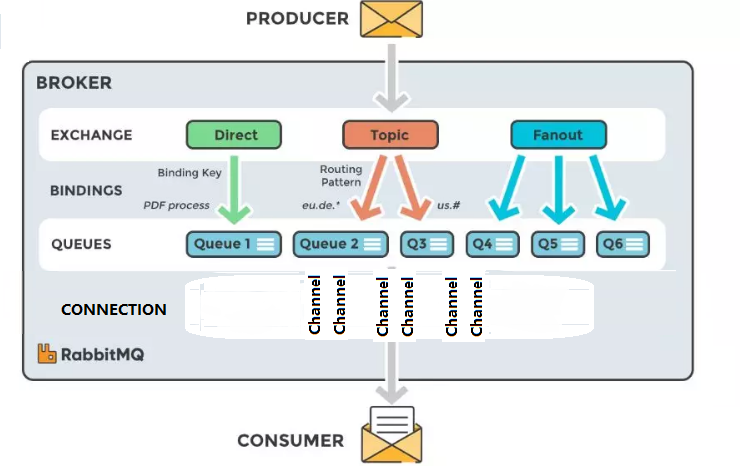
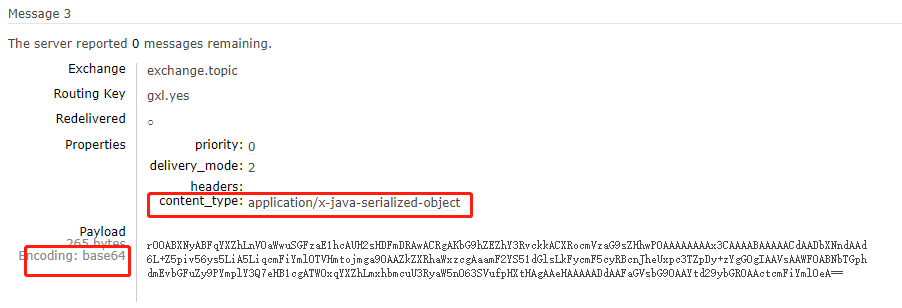
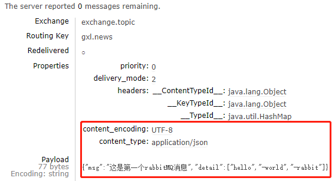
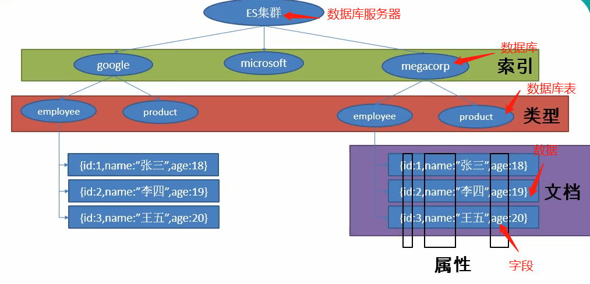

Spring boot 高级

# 缓存

## 重要概念及注解

### CacheManager

缓存管理器。管理各种Cache。  注意：直接操作缓存的是Cache而不是CacheManager

### Cache

缓存接口，定义和操作缓存。

Spring则提供了各种xxxCache的实现，比如RedisCache, EhCacheCache, ConcurrentMapCache等。

### @Cacheable

查询方法。 

运行逻辑：没有的情况下第一次查询数据库，放到缓存；后面就直接返回缓存中的值。

### @CacheEvict

清空缓存。

比如可以用在删除上，删除了某个对象，那么它对应的缓存也应该删除。

### @CachePut

更新缓存。 比如可以用在Update方法上。

运行逻辑：先执行方法，执行后直接放到缓存中。

注意：正常逻辑是更新去更新缓存，然后查询时也查到更新之后的值，那么需要保证查询和更新的缓存的key一致才行。CachePut默认的key是方法返回值对象名，值是返回值。

### @Caching

组合注解。以上增删改查的组合版

### @EnableCaching

​	开启基于注解的缓存。注解到SpringbootApplication上，注解才会生效！！！

### keyGenerator

​	key 生成策略。（缓存其实就是map,  key是主键，value是需要缓存的值。只不过这个Map可能很深，比如Map<String,Map<String,Object>> 或者Map<String,List<Map<String, Object>>> 嵌套的）

### Serialize

​	序列号策略。比如json, 文件之类的 

## 举例

### 开启注解

```java
//开启缓存注解，使用cache才有效
@EnableCaching
@MapperScan("com.gxl.study.springboot.mapper")
@SpringBootApplication
public class SpringbootApplication {...}
```

### 加入缓存

```java
//Cacheable将结果放到缓存中，之后直接使用
//cacheNames是放入key为哪个的缓存中，数组，可以放入多个缓存中。
//key="#{id}"把参数作为key,这就是策略。如果不写，则使用缓存对应的默认的策略。不同的缓存策略不同。
//condition 代表缓存条件
//sync 是否使用异步模式, 默认是false，不采用异步。
//keyGenerator是指定生成key的方法。可以自定义，实现keyGenerator接口返回对象即可。
//那么这个缓存最终可能就是Map<String,Map<String,Employee>> 。 emp这个缓存下的key=xx的值
@Cacheable(cacheNames = {"emp"}, key="#{id}", condition = "#id>0", sync=true, keyGenerator = "xxgeneratorName")
public Employee getById(Integer id){
    return employeeMapper.getById(id);
}
```


### 更新缓存

```java
//缓存的值是返回值
//key默认是返回值的名字，所以想要和get一起使用 需要让key相同
@CachePut(cacheNames = {"emp"}, key = "#id")
    public Employee update(Integer id){
        System.out.println("更新成功");
        return testMapper.updateValue(id);
    }
```


### 删除缓存

```java
//和更新同理
//还可以使用allEntries = true,则不需要指定key。代表删除整个emp下的缓存。默认是false
//beforeInvocation =true 则代表在方法执行之前删除，  默认是false
@CacheEvict(cacheNames = {"emp"}, key = "#id")
    public Integer delete(Integer id){
        System.out.println("删除成功");
        return testMapper.deleteValue(id);
    }
```


##  引入Redis

### 配置

1. 引入redis-starter

```xml
<dependency>
    <groupId>org.springframework.boot</groupId>
    <artifactId>spring-boot-starter-data-redis</artifactId>
</dependency>
```

2. 启动项

CacheAutoConfiguration导入CacheConfigurationImportSelector, 找到所有的配置，根据顺序去找。最终RedisCache

```java
static class CacheConfigurationImportSelector implements ImportSelector {
		@Override
		public String[] selectImports(AnnotationMetadata importingClassMetadata) {
			CacheType[] types = CacheType.values();
			String[] imports = new String[types.length];
			for (int i = 0; i < types.length; i++) {
				imports[i] = CacheConfigurations.getConfigurationClass(types[i]);
			}
			return imports;
		}
	}
```


RedisCacheConfiguration.java

```java
@Configuration(proxyBeanMethods = false)
@ConditionalOnClass(RedisConnectionFactory.class)
@AutoConfigureAfter(RedisAutoConfiguration.class)
@ConditionalOnBean(RedisConnectionFactory.class)
@ConditionalOnMissingBean(CacheManager.class)
@Conditional(CacheCondition.class)
class RedisCacheConfiguration {
	@Bean
    //加入了cacheManager，  所以后续的xxCacheConfiguration就不会生效了。因为有ConditionalOnMissingBean说没有CacheManager才会生效。
	RedisCacheManager cacheManager(...) {
		....
	}
```


1. 自定义RedisTemplate

```java
@Configuration
public class MyRedisConfig {


    //只改变Employee的序列化规则
    @Bean
    public RedisTemplate<Object, Employee> redisTemplate(RedisConnectionFactory redisConnectionFactory)
            throws UnknownHostException {
        RedisTemplate<Object, Employee> template = new RedisTemplate<>();
        
        template.setConnectionFactory(redisConnectionFactory);
        //json序列化规则
        Jackson2JsonRedisSerializer<Object> jackson2JsonRedisSerializer = new Jackson2JsonRedisSerializer<>(Object.class);
        ObjectMapper om = new ObjectMapper();
        om.setVisibility(PropertyAccessor.ALL, JsonAutoDetect.Visibility.ANY);
        jackson2JsonRedisSerializer.setObjectMapper(om);
        //String序列化规则
        StringRedisSerializer stringRedisSerializer = new StringRedisSerializer();
        // key采用String的序列化方式
        template.setKeySerializer(stringRedisSerializer);
        // hash的key也采用String的序列化方式
        template.setHashKeySerializer(stringRedisSerializer);
        // value序列化方式采用jackson
        template.setValueSerializer(jackson2JsonRedisSerializer);
        // hash的value序列化方式采用jackson
        template.setHashValueSerializer(jackson2JsonRedisSerializer);
        template.afterPropertiesSet();
        //或者上面设置都不要 直接设置default
//        template.setDefaultSerializer(jackson2JsonRedisSerializer);
        return template;
    }

}
```


# 消息中间件

## 作用

提升异步通信和扩展解耦的能力。

比如用户确认后会发送短信和邮件，三种模式。当然更提倡第三种。更容易扩展和解耦。因为你不需要关心中间件去做什么。

- 确认后，先发邮件，再发短信，最后响应给用户
- 确认后直接响应给用户。然后新启线程一发送邮件，线程二发送短信，
- 确认后直接响应给用户。然后推送给消息中间件，由中间件去处理发送邮件和短信。

## 概念

### 消息代理

即中间件。message broker

### 目的地

即消息队列。destination

主要有两种形式

- 队列（queue）：点对点消息通信
- 主题（topic）：发布(publish) / 订阅(subscribe) 消息通信

## 规范

### JMS

java message service

java消息服务，基于JVM消息代理的规范。**ActiveMQ**, HornetMQ是其具体实现。


### AMQP

advanced message queuing protocol

高级队列协议，也是一个消息代理的规范，兼容JMS。**RabbitMQ**是其高级实现。


对比：

|              | JMS                                                          | AMQP         |
| ------------ | ------------------------------------------------------------ | ------------ |
| 定义         | java api                                                     | 网络线级协议 |
| 跨语言       | 否                                                           | 是           |
| 跨平台       | 否                                                           | 是           |
| 支持消息类型 | 多种消息类型：<br />TextMessage<br />MapMessage<br />ByteMessage ... | byte[]       |
| 综合评价     |                                                              |              |

## RabbitMQ

### 核心概念

#### Message

消息，有消息体和消息头构成。消息体是不透明的，而消息头是由一系列可选属性构成。比如路由键（routing-key）, 优先权（priority），是否持久储存（delivery-mode）

#### Publisher

消息的产生者。也是一个向交换器发布消息的客户端应用程序

#### Exchange

交换器，用来接受生产者发送的消息并将这些消息路由发送给服务器中的队列。和平常使用的交换机一个道理。

Exchange有4种类型：direct(默认) , fanout, topic, headers

##### direct

点对点通信，所以必须匹配key。队列的key和路由的key必须一致才会绑定，然后发送消息。不一致的不会收到消息。他是完全匹配的。

##### fanout

广播式（订阅），不管队列的key是什么，都会发送到与该路由器绑定的队列上。称之为简单绑定。

发送速度是最快的。

##### topic

匹配分配消息。按照某种规则去发送，类似于direct。 只不过是模糊匹配。 利用# 或者*进行匹配

#### Queue

消息队列，将消息放入消息队列中。

#### Binding

绑定 

#### Connection

建立通信，比如TCP

#### Channel

信道。比如TCP, UDP连接 ，会产生一个通道。在通道里面获取信息。而不是重复建立Connection

#### Consumer

消费者。从消息队列中取得消息的客户端程序。

### 图解




### 基本操作

```shell
#默认是获取latest,即没有web manager版本
docker pull rabbitmq 
#运行镜像
#-d后台运行 -p映射端口 --name别名  --restart是重启之后还能继续使用
docker run --restart=always -d -p 5672:5672 -p15672:15672 --name myrabbitmq yourDockerID
#查看所有镜像 不管是否启用
docker container ls -a
#如果已经停止了 需要启动start 而不是run命令
docker start containerID
#进入docker中的rabbitmq  用别名   /bin/bash 是命令行模式
docker exec -it myrabbitmq /bin/bash
#查看rabbitmq状态
rabbitmqctl status
#如果rabbit web 模块不能使用 记得安装插件：会提示成功，然后浏览器打开就可以了
rabbitmq-plugins enable rabbitmq_management
```


### 整合

1. 使用docker镜像

2. 开放接口（一共有两个接口，一个是界面化的15672，一个是程序使用的6572 ）

3. 添加maven依赖

4. 配置properties / yml.

5. 测试

   Test.java

```java
@Test
    void testConnection(){
        //原声的发送消息，指定exchange和routeKey， 还有消息内容需要封装成Message对象
//        rabbitTemplate.send(exchange, routeKey, message);
        //所以提供了更方便的方法
        HashMap<String,Object> map = new HashMap<>();
        map.put("msg","这是第一个rabbitMQ消息");
        map.put("detail", Arrays.asList("hello","-world","-rabbit"));
        rabbitTemplate.convertAndSend("exchange.topic","gxl.news",map);
        System.out.println("==========send success!");

        //同样的 获取也提供了两种方式
        //获取到Message对象 自己转换成具体的消息
//        Message receive = rabbitTemplate.receive("gxl.news");
        //获取到指定类型的对象，根据自己配置的messageConverter转换，默认是jdk的序列化方式
        Object o = rabbitTemplate.receiveAndConvert("gxl.news");
        System.out.println("==========receive success!");
        System.out.println(o);
    }
```

MyRabbitConfig.java

```java
@Configuration
public class MyRabbitConfig {
    //加入自定义的messageConverter
    @Bean
    public MessageConverter messageConverter(){
        return new Jackson2JsonMessageConverter();
    }
}
```


结果：

//未自定义序列化方式，默认是jdk的方式



//自定义json序列化方式




### 自动配置原理

1. RabbitAutoConfiguration开启自动配置

2. ConnectionFactory：连接工厂

3. RabbitProperties封装了Rabbit的默认配置

   ```java
   //如果不配置，就是默认下面这些配置
   //如果要自定义，就以spring.rabbitmq 打头的一些属性进行配置
   @ConfigurationProperties(prefix = "spring.rabbitmq")
   public class RabbitProperties {
   	private String host = "localhost";
   	private int port = 5672;
   	private String username = "guest";
   	private String password = "guest";
   
   ```

   

4. RabbitTemplate：给RabbitMQ发送和接受消息

   ```java
   //一般使用两种
   //发送并转换消息
   public void convertAndSend(String exchange, String routingKey, Object object) throws AmqpException {...}
   //接收并转换消息
   public Object receiveAndConvert(String queueName) throws AmqpException {...}
   ```

   

5. AmqpAdmin：RabbitMQ系统管理功能

比如创建Exchange, 创建Queue， 绑定规则等。

# 检索

主要是ElasticSearch

## 概念解析

- ES集群：对应数据库ip地址，比如mysql数据库
- 索引：对应具体的mysql中某个数据库
- 类型：对应数据库中的表。比如员工类型就放到员工表
- 文档：对应表中的数据，一个文档就是一条数据。
- 属性：对应表的字段，一个属性就是一个字段。



## 与SpringBoot整合

springBoot默认支持两种技术与ES交互

- Jest

  - 默认不会启用，还需要配合jest相关包

- SpringData ElasticSearch

  - 默认方式。
  - 但是可以会有版本不适配的情况，匹配版本即可。
  - Client节点信息，clusterNodes, clusterName
  - ElasticsearchTemplate 操作ES
  - 编写一个ElasticsearchRepository子接口操作ES

  

# 任务

## 异步任务

springboot提供了简便的异步支持

1. 启动程序上开启异步@EnableAsync
2. 在需要异步的方法上添加注解@Async

```java
@Service
public class SomeAsyncService {
    //需要注意的是，开启异步之后就不能去等待返回值。用Future<T>获取返回值
    @Async
    public void doSomethingAsync(){
        System.out.println("=======测试异步任务..");
        try {
            Thread.sleep(3000);
        } catch (InterruptedException e) {
            e.printStackTrace();
        }
    }
}
```

## 自动任务

springboot提供了简易的自动任务Schedule,  如果想要复杂的自动任务则使用自动任务框架Quartz。

PS.在线编辑cron表达式：[cron表达式](http://cron.qqe2.com/)

1. 开启自动任务注解
2. 在需要自动按时执行的方法上加入@Scheduled注解，并加入cron表达式，指定按什么规则执行。
3. 加入@Service注解放到spring容器

代码示例：

```java
//开启自动任务
@EnableScheduling
@Service
public class ScheduleService {

    private static int i = 0;

    //每5秒执行一次
    @Scheduled(cron = "0/5 * * * * ?")
    public void schedule1(){
        System.out.println("=====say hello....."+i+"...."+new Date());
        i++;
    }
}
```

执行效果如下：

```txt
=====say hello.....0....Wed Feb 12 11:21:35 CST 2020
=====say hello.....1....Wed Feb 12 11:21:40 CST 2020
=====say hello.....2....Wed Feb 12 11:21:45 CST 2020
```


## 邮件任务

1. 引入spring-boot-starter-mail  （spring2.0自动整合了）
2. springboot自动配置在MailSenderAutoConfiguration
3. 定义MailProperties内容，配置在application.yml中
4. 自动装配JavaMailSender
5. 测试

### 配置

```yaml
spring:
  mail:
    host: smtp.163.com
    username: gouxionglai@163.com
    password: qwer12356
    protocol: smtp
    properties:
      mail:
        smtp:
          auth: true
#        starttls:
#          enable: true
#          required: true
```

### 封装邮件方法

封装很好的例子：

<https://www.cnblogs.com/chenjb-0218/p/8058639.html>	//感觉有点老了 但是思路很好

<https://blog.csdn.net/qq_31984879/article/details/87516363>	//主要参考的这个

```java
@Service
public class MailService {
    private Logger logger = LoggerFactory.getLogger(MailService.class);

    @Value("${spring.mail.username}")
    private String MAIL_SENDER;

    @Autowired
    private JavaMailSender mailSender;
    @Autowired
    private TemplateEngine templateEngine;

    //异步发送
    @Async
    public void sendSimpleMail(String subject, String content, String... to){
        SimpleMailMessage message = new SimpleMailMessage();
        message.setFrom(MAIL_SENDER); // 发送人的邮箱
        message.setSubject(subject); //标题
        message.setTo(to); //发给谁  对方邮箱
        message.setText(content); //内容
        mailSender.send(message); //发送
    }

    /**
     * 发送邮件
     * @param subject 主题
     * @param content 邮件内容，如果是普通邮件就是简单的字符串；如果是复杂邮件则通过templateEngine.process转换
     * @param attachment 附件
     * @param to  接收人数组
     */
    @Async
    public void sendMimeMail(String subject, String content,File attachment,String... to){

        MimeMessage mimeMailMessage = null;
        try {
            mimeMailMessage = mailSender.createMimeMessage();
            MimeMessageHelper mimeMessageHelper = new MimeMessageHelper(mimeMailMessage, true);
            mimeMessageHelper.setFrom(MAIL_SENDER);
            //接收人
            mimeMessageHelper.setTo(to);
            //主题
            mimeMessageHelper.setSubject(subject);
            //有内容才发送内容
            if(content !=null){
                mimeMessageHelper.setText(content, true);
            }
            //有附件才发送附件
            if(attachment !=null){
                mimeMessageHelper.addAttachment(attachment.getName(), attachment);
            }
            mailSender.send(mimeMailMessage);
            System.out.println("==============邮件发送成功");
        } catch (Exception e) {
            logger.error("邮件发送失败", e.getMessage());
        }
    }

    @Async
    public void sendTemplateMail(String uid,String... to) throws Exception{
        //创建邮件正文
		//org.thymeleaf.context.Context;
        Context context = new Context();
        context.setVariable("uid", uid);
        //注意：process第一个参数名称要和templates下的模板名称一致。要不然会报错
        try{
            //org.thymeleaf.TemplateEngine;
            String emailContent = templateEngine.process("mail/emailTemplate", context);
            File attachment = new File("C:\\Users\\gouxi\\Pictures\\856736d1f3ec9eaedb2985d875fd653e.gif");
            this.sendMimeMail("这是账号验证模板", emailContent, attachment, to);
        }catch(Exception e){
            logger.error("邮件发送失败", e.getMessage());
        }
    }
}
```

### 模板页面

```html
<!DOCTYPE html>
<html lang="zh" xmlns:th="http://www.thymeleaf.org">

<head>
    <meta charset="UTF-8"/>
    <title>Title</title>
</head>
<body>
    您好,这是验证邮件,请点击下面的链接完成验证:
    <br/>
    <h2>
        <span th:text="${uid}">123123</span>
        <!--这里不能写动态的server前缀 必须固定 应该是编译期不一样导致的-->
        <!--<a href="#" th:href="@{/emp/{id}(id=${uid})}">激活账号</a>-->
        <a href="#" th:href="@{ http://www.baidu.com/{id}(id=${uid}) }">激活账号</a>
    </h2>
</body>
</html>
```


### 测试类

```java
@ResponseBody
    @GetMapping("/sendmail")
    public Object sendMail(){
        String id = "006";
        String to = "******@qq.com";
        try {
            mailService.sendTemplateMail(id,to);
        } catch (Exception e) {
            e.printStackTrace();
        }
        return "success";
    }
```


# 安全认证

常见框架是Shiro 和 Spring Security

开启认证

设置权限

注销权限

# 分布式

# 热部署

# 监管

