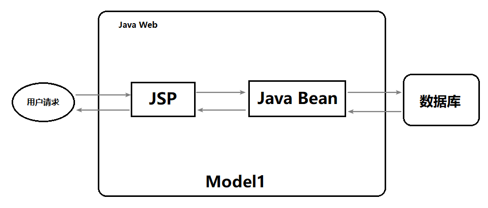
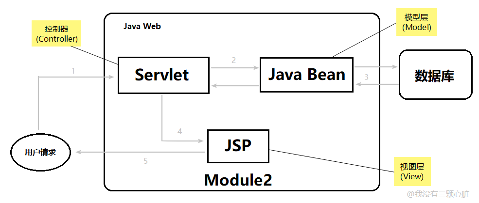
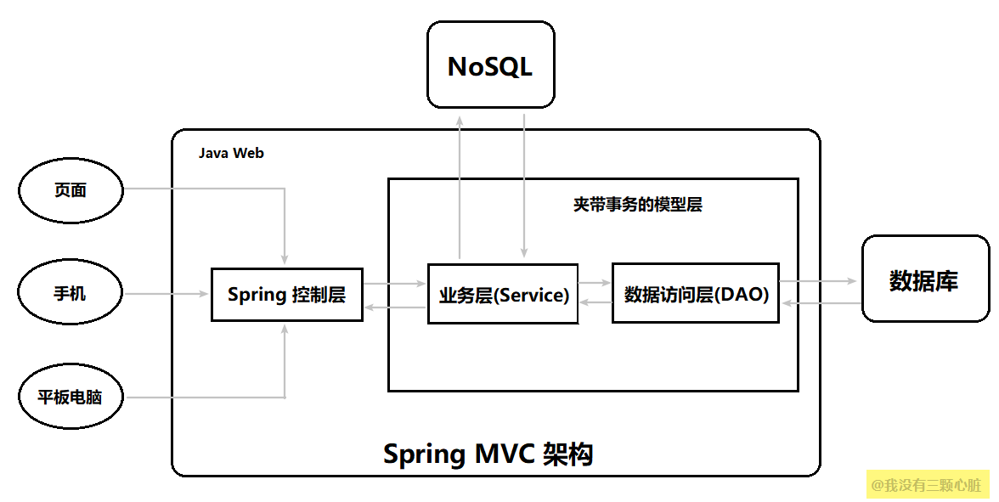
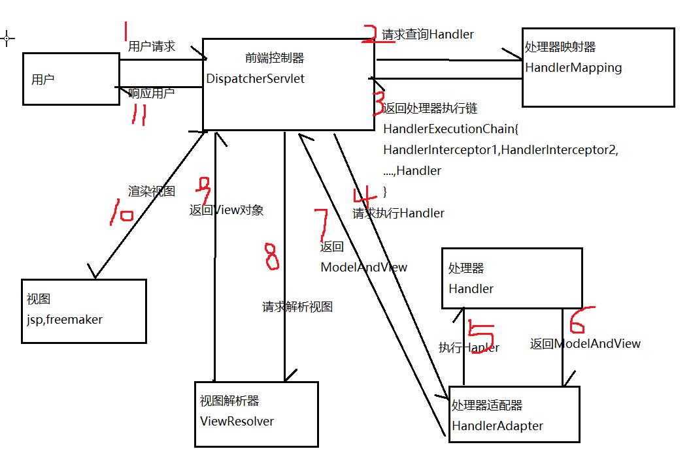
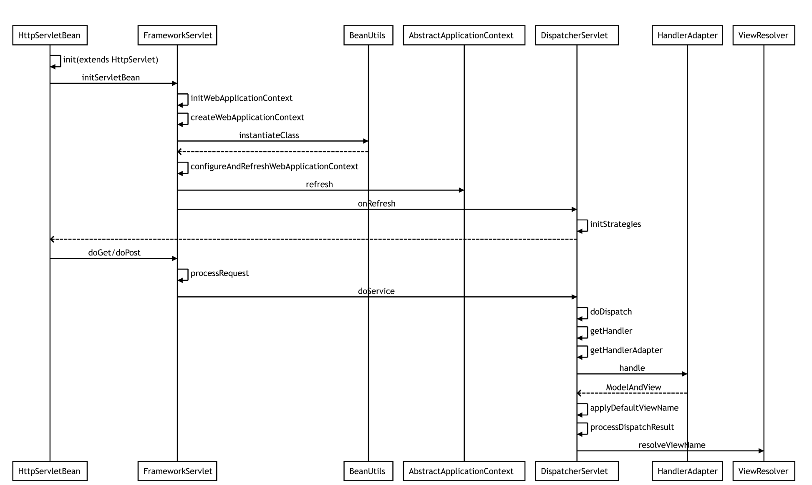

# springMVC

[入门参考](https://www.jianshu.com/p/91a2d0a1e45a)

[全面参考](https://www.cnblogs.com/zhaojiankai/p/8142834.html)

[源码分析](https://www.cnblogs.com/fangjian0423/p/springMVC-xml-json-convert.html)

**M 代表 模型（Model）**
 模型是什么呢？ 模型就是数据，就是 dao,bean

 **V 代表 视图（View）**
 视图是什么呢？ 就是网页, JSP，用来展示模型中的数据

 **C 代表 控制器（controller)**
 控制器是什么？ 控制器的作用就是把不同的数据(Model)，显示在不同的视图(View)上，Servlet 扮演的就是这样的角色。

## mvc来源

 **Model1：**在早期 Java Web 的开发中，统一把显示层、控制层、数据层的操作全部交给 JSP 或者 JavaBean 来进行处理，我们称之为




**Model2：**Servlet + JSP + Java Bean 所替代了，早期的 MVC 模型就像下图这样：




**MODEL3：**传统的模型层被拆分为了业务层(Service)和数据访问层（DAO,Data Access Object）。 在 Service 下可以通过 Spring 的声明式事务操作数据访问层，而在业务层上还允许我们访问 NoSQL ，这样就能够满足异军突起的 NoSQL 的使用了，它可以大大提高互联网系统的性能。




## mvc请求逻辑




## 配置

### web.xml

- 加载配置文件
```xml
<context-param>
	<param-name>contextConfigLocation</param-name>
    <!--多个配置文件用逗号,分隔 -->
    <param-value>classpath:spring-mybatis.xml,classpath:applicationContext.xml</param-value>
    </context-param>
<!--监听ioc容器-->
<listener>
	<listener-class>org.springframework.web.context.ContextLoaderListener</listener-class>
</listener>
```

- 配置核心控制器
```xml
<!-- 配置SpringMVC核心控制器 -->
<servlet>
    <servlet-name>dispatcherServlet</servlet-name>
    <servlet-class>org.springframework.web.servlet.DispatcherServlet</servlet-class>
    <init-param>
    <param-name>contextConfigLocation</param-name>
    <param-value>classpath:spring-mvc.xml</param-value>
    </init-param>
    <init-param>
        <param-name>throwExceptionIfNoHandlerFound</param-name>
        <param-value>false</param-value>
    </init-param>
    <load-on-startup>2</load-on-startup>
</servlet>
<servlet-mapping>
    <servlet-name>dispatcherServlet</servlet-name>
    <url-pattern>/</url-pattern>
</servlet-mapping>
```

- 字符集过滤
```xml
<filter>
    <filter-name>CharacterEncodingFilter</filter-name>
    <filter-class>org.springframework.web.filter.CharacterEncodingFilter</filter-class>
    <init-param>
        <param-name>encoding</param-name>
        <param-value>utf-8</param-value>
    </init-param>
</filter>
<filter-mapping>
    <filter-name>CharacterEncodingFilter</filter-name>
    <url-pattern>/*</url-pattern>
</filter-mapping>
session失效时间
<session-config>
    <session-timeout>43200</session-timeout>
</session-config>
```


### spring.xml

### spring-mybatis.xml

### spring-mvc.xml

- 视图解析器

```xml
<bean class="org.springframework.web.servlet.view.InternalResourceViewResolver">
<!--这里的配置我的理解是自动给后面action的方法return的字符串加上前缀和后缀，变成可用的url地址-->
    <property name="prefix" value="/WEB-INF/pages/"/>
    <property name="suffix" value=".jsp"/>
</bean>
```
- 自定义类型转换器

```xml
<!-- 配置自定义转换器 注意: 一定要将自定义的转换器配置到注解驱动上 -->
    <bean id="conversionService" class="org.springframework.format.support.FormattingConversionServiceFactoryBean">
        <property name="converters">
            <set>
                <!-- 指定自定义转换器的全路径名称 -->
                <!-- 日期自定义转换器 -->
                <bean class="com.gxl.framework.converter.CustomDateConverter"/>
            </set>
        </property>
    </bean>
```

- 开启注解驱动

```xml
<!-- 开启注解驱动 和jackson搭配使用 @ResponseBody返回json格式-->
<!--会自动注册RequestMappingHandlerMapping, RequestMappingHandlerAdapter, ExceptionHandlerExceptionResolver 这三个bean,是spring MVC为@Controllers分发请求所必须的-->
<!--加conversionService是使自定义转换器生效-->
<!--HttpMessageConverter对request到服务器，服务器到response自动类型转换的一个类-->
<mvc:annotation-driven conversion-service="conversionService">
    <mvc:message-converters>
        <bean class="org.springframework.http.converter.StringHttpMessageConverter">
            <property name="supportedMediaTypes">
                <list>
                    <!--指定conten-tyoe需要的编码-->
                    <value>text/plain;charset=UTF-8</value>
                    <value>text/html;charset=UTF-8</value>
                    <value>application/json;charset=UTF-8</value>
                </list>
            </property>
        </bean>
    </mvc:message-converters>
</mvc:annotation-driven>
```


- 配置扫描包 + 控制器增强 (异常处理器)

```xml
<!-- 使用Annotation自动注册Bean,扫描@Controller和@ControllerAdvice-->
    <context:component-scan base-package="com.gxl.framework.controller"
                            use-default-filters="false">
        <!-- base-package 如果多个，用“,”分隔 -->
        <context:include-filter type="annotation" expression="org.springframework.stereotype.Controller"/>

        <!--控制器增强，使一个Contoller成为全局的异常处理类，类中用@ExceptionHandler方法注解的方法可以处理所有Controller发生的异常-->
        <context:include-filter type="annotation  expression="org.springframework.web.bind.annotation.ControllerAdvice"/>
    </context:component-scan>
```


- 上传文件处理器

```xml
<!-- SpringMVC上传文件时，需要配置MultipartResolver处理器 -->
<!--配置之后可以使用MultipartFile去获取上传的文件-->
<bean id="multipartResolver" class="org.springframework.web.multipart.commons.CommonsMultipartResolver">
	<property name="defaultEncoding" value="UTF-8"/>
	<!-- 指定所上传文件的总大小不能超过100M。注意maxUploadSize属性的限制不是针对单个文件，而是所有文件的容量之和 -->
	<property name="maxUploadSize" value="1100000000"/>
</bean>
```

- 静态资源标记

```xml
<!-- 配置静态资源访问 -->
    <!-- 方式一 框架自己判断-->
    <!--<mvc:default-servlet-handler />-->

    <!-- 方式二 自己标明 -->
    <mvc:resources mapping="/**" location="/" />
    <mvc:resources mapping="/css/**" location="/css/"/>
    <mvc:resources mapping="/img/**" location="/img/"/>
    <mvc:resources mapping="/js/**" location="/js/"/>
    <mvc:resources mapping="/userfiles/upload/**" location="/userfiles/upload/"/>
```
- 登陆拦截

```xml
<mvc:interceptors>
        <!--登录拦截器-->
        <mvc:interceptor>
            <!--拦截的范围-->
            <!--还有个标签 mvc:exclude-mapping 指的是不拦截的路径-->
            <mvc:mapping path="/**"/>
            <bean class="com.gxl.framework.handler.interceptor.LoginInterceptor">
                <property name="allowUrls">
                    <list>
                        <!-- 如果请求中包含以下路径，则不进行拦截 -->
                        <value>/login</value>
                        <value>/loginIndex</value>
                        <value>/css</value>
                        <value>/img</value>
                        <value>/js</value>
                        <value>/userfiles/upload/</value>
                        <value>/userfiles/user/photo/</value>
                        <value>/ckeditor/plugins/smiley/images/</value>
                        <!--小程序公开api-->
                        <value>/webservice/api/wechat/miniprogram/</value>
                        <!--融云公开路由-->
                        <value>/webservice/api/mobile/oa/im/openapi/</value>
                    </list>
                </property>
            </bean>
        </mvc:interceptor>
    </mvc:interceptors>
```

  

## 注解

### @RequestMapping

- value:
  - 类和方法上的value拼接起来组成请求地址。
  - 只有value的情况下可以省略不写。
- method
  - 数组：一般是get or post，
  - 默认是get
- params
  - 数组，指定参数和值
- headers
  - 数组，包含指定头文件，多个用逗号分隔

```java
@Controller
@RequestMapping("/demo")
public class DemoController implements Serializable {

//页面请求地址应该为"demo/test2"  注意demo前面不要加/ (相对路径，加了/是绝对路径) 否则会在根路径下去找
//params={"age","name=嘿"} 代表包含age的参数即可，name的值则必须为"嘿"
//headers同理
@RequestMapping(value ="/test2",method = {RequestMethod.POST},params = {"name=嘿","age"},headers = {"User-Agent"})
    public Object test2(Model model){
        String message = "hello world222!!!哈哈哈哈";
        System.out.println(message);
        model.addAttribute("message",message);
        model.addAttribute("current_time",new Date());
        //跳转到xx/welcome.jsp页面
        return "welcome";
    }
```


### @RequestParam

匹配前台传过来的参数名称。如果一样的话，可以省略。

```java
//前端传递的参数名为 age
//required = true/false  代表是否必须
//value =具体的值
//defaultValue 如果没有传则默认值是多少
public Object test2(Model model, Date date,@RequestParam(required = true, value = "age",defaultValue = "0") String userAge)
```


### @CookieValue

获取cookie的值。

```java
//在cookie中拿JESSIONID的值
public String testMethod(@CookieValue(value="JESSIONID") String cookieValue){...}
```


### @ModelAttribute

充当了HttpServletRequset+HttpServletResponse的传值功能。相当于一个map，可以从后台传递到前台的request域里面。

```java
public String testModelAttribute(Model model){
    User user = xxx; //实例化user
    model.addAttribute("user",user); //request域就有了key=user的user对象
    return "xx页面";
}
//jsp直接用${user.xxx}获取user对应的xxx属性
```


### @ResponseBody

源码解析参考：

<https://www.cnblogs.com/liaojie970/p/7736098.html>

​	即将方法的返回值作为reponse的body返回给客户端，不同的类型处理不一样。这个过程的处理都是靠许许多多的HttpMessageConverter转换器来完成的。

​	常见的方法返回的类型有：text/html、text/plain、text/xml、application/json、application/x-www-form-urlencoded、image/png等，不同的类型，对body中的数据的解析也是不一样的。

​	实际运用最多，直接以json格式返回，ajax请求局部刷新

​	@ResponseBody可以指定content-type，打开ResponseBody注释，我们可以看到这两个属性consumes和produces，它们就是用来指定request的content-type和response的content-type的

补充下知识点：返回值

- 正常的return是跳转页面，项目路径下的完整路径+页面名称，如果配置了试图解析器的prefix和suffix则不用写前后缀。
- 方法或者类上添加了@ResponseBody注解以后，代表return的不是页面，而是一个json字符串。
- 方法返回值为void
  - 其默认返回值是当前请求路径的同名的页面。比如demo/hello，  则去找suffix/demo/hello.jsp
  - 自己定义请求转发，如情况1
  - 自己定义请求重定向，如情况2
  - 自己定义输出，如情况3

```java
@RequestMapping("/testVoid")
    public void testVoid(HttpServletRequest request,HttpServletResponse response) throws ServletException, IOException {
        System.out.println("testVoid  执行了...");
        //情况1 转发需要写完整的路径
        request.getRequestDispatcher("/WEB-INF/demo/target1.jsp").forward(request,response);
        
        //情况2 重定向: 没有WEB-INF了
        response.sendRedirect(request.getContextPath()+"/demo/target1.jsp" );
        
        //情况3 自己写响应
        response.setCharacterEncoding("UTF-8");
        response.setContentType("text/html;charset=UTF-8");
        response.getWriter().write("嘿嘿嘿");
    }
```


### @Valid

## 请求参数绑定

<https://www.cnblogs.com/fangjian0423/p/springMVC-databind-typeconvert.html>

比如我们自定义的String 转date类型，是怎么实现的。

### 例子：String 转 Date

```java
//String 转 Date
//发现属性的类型是Date则会调用这个converter
public class CustomDateConverter implements Converter<String, Date>{

    private static final List<String> formarts = new ArrayList<String>(5);
    static{
        //即下面这种规则传过来的String的值，会转换成对应的date
        formarts.add("yyyy-MM");
        formarts.add("yyyy-MM-dd");
        formarts.add("yyyy-MM-dd HH:mm");
        formarts.add("yyyy-MM-dd HH:mm:ss");
        formarts.add("yyyyMMdd");
    }
    
    /**
     * 将字符串自动转换成日期
     */
    @Override
    public Date convert(String source) {
        String value = source.trim();
        if ("".equals(value)) {
            return null;
        }
        if(source.matches("^\\d{4}-\\d{1,2}$")){
            return parseDate(source, formarts.get(0));
        }else if(source.matches("^\\d{4}-\\d{1,2}-\\d{1,2}$")){
            return parseDate(source, formarts.get(1));
        }else if(source.matches("^\\d{4}-\\d{1,2}-\\d{1,2} {1}\\d{1,2}:\\d{1,2}$")){
            return parseDate(source, formarts.get(2));
        }else if(source.matches("^\\d{4}-\\d{1,2}-\\d{1,2} {1}\\d{1,2}:\\d{1,2}:\\d{1,2}$")){
            return parseDate(source, formarts.get(3));
        }else if(source.matches("^\\d{8}$")){
            return parseDate(source, formarts.get(4));
        }else {
            throw new IllegalArgumentException("Invalid boolean value '" + source + "'");
        }
    }

    /**
     * 功能描述：格式化日期
     *
     * @param dateStr
     *            String 字符型日期
     * @param format
     *            String 格式
     * @return Date 日期
     */
    private  Date parseDate(String dateStr, String format) {
        Date date=null;
        try {
            DateFormat dateFormat = new SimpleDateFormat(format);
            date = (Date) dateFormat.parse(dateStr);
        } catch (Exception e) {
        }
        return date;
    }

}
```


### 获取绑定错误信息BindingResult

BindingResult：

如果在绑定过程中报错，比如日期2019-13-133 肯定会转换出错。错误信息会记录到BindingResult。

api：

- 获取异常长度：result.getErrorCount()>0
- 获取所有异常：result.getFieldErrors()
- 获取异常的字段：fieldError.getField()
- 获取异常信息：fieldError.getDefaultMessage()

```java
@RequestMapping(value ="/testBindData")
    public Object testBindData(Model model, User user, BindingResult result){
        System.out.println("testBindData 执行了...");
        //判断是否有异常
        if(result.getErrorCount()>0){
            //遍历异常
            for(FieldError error : result.getFieldErrors()){
                System.out.println("绑定过程中报错了："+ error.getField() +"---"+error.getDefaultMessage());
            }
        }
        user.setId(3L);
        model.addAttribute("user",user);
        //跳转到xx/welcome.jsp页面
        return "welcome";
    }
```


### 源码：

```java
//ModelAttributeMethodProcessor.class
//parameter：方法的参数，比如User
//ModelAndViewContainer：装model+ view
@Nullable
    public final Object resolveArgument(MethodParameter parameter, @Nullable ModelAndViewContainer mavContainer, NativeWebRequest webRequest, @Nullable WebDataBinderFactory binderFactory) throws Exception {
        Assert.state(mavContainer != null, "ModelAttributeMethodProcessor requires ModelAndViewContainer");
        Assert.state(binderFactory != null, "ModelAttributeMethodProcessor requires WebDataBinderFactory");
        //这里拿到的是beanName: 比如user
        String name = ModelFactory.getNameForParameter(parameter);
        ModelAttribute ann = (ModelAttribute)parameter.getParameterAnnotation(ModelAttribute.class);
        if (ann != null) {
            mavContainer.setBinding(name, ann.binding());
        }

        Object attribute = null;
        BindingResult bindingResult = null;
        if (mavContainer.containsAttribute(name)) {
            attribute = mavContainer.getModel().get(name);
        } else {
            try {
                //反射找构造方法创建实例化对象
                attribute = this.createAttribute(name, parameter, binderFactory, webRequest);
            } catch (BindException var10) {
                if (this.isBindExceptionRequired(parameter)) {
                    throw var10;
                }

                if (parameter.getParameterType() == Optional.class) {
                    attribute = Optional.empty();
                }
				//错误信息记录到 bindingResult
                bindingResult = var10.getBindingResult();
            }
        }
		//有错则代表实例化对象出错，就不继续绑定值了
        if (bindingResult == null) {
            WebDataBinder binder = binderFactory.createBinder(webRequest, attribute, name);
            if (binder.getTarget() != null) {
                if (!mavContainer.isBindingDisabled(name)) {
                    //具体执行绑定：doBind里面遍历参数去setPropertyValues
                    this.bindRequestParameters(binder, webRequest);
                }

                this.validateIfApplicable(binder, parameter);
                if (binder.getBindingResult().hasErrors() && this.isBindExceptionRequired(binder, parameter)) {
                    throw new BindException(binder.getBindingResult());
                }
            }

            if (!parameter.getParameterType().isInstance(attribute)) {
                attribute = binder.convertIfNecessary(binder.getTarget(), parameter.getParameterType(), parameter);
            }

            bindingResult = binder.getBindingResult();
        }

        Map<String, Object> bindingResultModel = bindingResult.getModel();
        mavContainer.removeAttributes(bindingResultModel);
        mavContainer.addAllAttributes(bindingResultModel);
        return attribute;
    }
```

执行参数类型转换后绑定

```java
private void processLocalProperty(AbstractNestablePropertyAccessor.PropertyTokenHolder tokens, PropertyValue pv) {
    //根据属性名去找，如果有对应的get/set，则会返回ph， 如果没有该属性或者没有get/set就返回空，不执行绑定
    //返回ph还需要判断是否需要类型转换，根据属性的类型和当前类型找合适的converter，然后执行转换。比如StringToNumberConverterFactory.convert   string转int 
        AbstractNestablePropertyAccessor.PropertyHandler ph = this.getLocalPropertyHandler(tokens.actualName);
        if (ph != null && ph.isWritable()) {
            Object oldValue = null;

            PropertyChangeEvent propertyChangeEvent;
            try {
                Object originalValue = pv.getValue();
                Object valueToApply = originalValue;
                //是否需要转换类型
                if (!Boolean.FALSE.equals(pv.conversionNecessary)) {
                    if (pv.isConverted()) {
                        valueToApply = pv.getConvertedValue();
                    } else {
                        if (this.isExtractOldValueForEditor() && ph.isReadable()) {
                            try {
                                oldValue = ph.getValue();
                            } catch (Exception var8) {
                                Exception ex = var8;
                                if (var8 instanceof PrivilegedActionException) {
                                    ex = ((PrivilegedActionException)var8).getException();
                                }

                                if (logger.isDebugEnabled()) {
                                    logger.debug("Could not read previous value of property '" + this.nestedPath + tokens.canonicalName + "'", ex);
                                }
                            }
                        }
						//关键是这一句，根据转换器转换成对应类型的值
                        valueToApply = this.convertForProperty(tokens.canonicalName, oldValue, originalValue, ph.toTypeDescriptor());
                    }

                    pv.getOriginalPropertyValue().conversionNecessary = valueToApply != originalValue;
                }
				//正式赋值  反射执行setXxx
                ph.setValue(valueToApply);
            } catch (TypeMismatchException var9) {
                throw var9;
            } catch (InvocationTargetException var10) {
                propertyChangeEvent = new PropertyChangeEvent(this.getRootInstance(), this.nestedPath + tokens.canonicalName, oldValue, pv.getValue());
                if (var10.getTargetException() instanceof ClassCastException) {
                    throw new TypeMismatchException(propertyChangeEvent, ph.getPropertyType(), var10.getTargetException());
                } else {
                    Throwable cause = var10.getTargetException();
                    if (cause instanceof UndeclaredThrowableException) {
                        cause = cause.getCause();
                    }

                    throw new MethodInvocationException(propertyChangeEvent, cause);
                }
            } catch (Exception var11) {
                propertyChangeEvent = new PropertyChangeEvent(this.getRootInstance(), this.nestedPath + tokens.canonicalName, oldValue, pv.getValue());
                throw new MethodInvocationException(propertyChangeEvent, var11);
            }
        } else if (pv.isOptional()) {
            if (logger.isDebugEnabled()) {
                logger.debug("Ignoring optional value for property '" + tokens.actualName + "' - property not found on bean class [" + this.getRootClass().getName() + "]");
            }

        } else {
            throw this.createNotWritablePropertyException(tokens.canonicalName);
        }
    }
```


## JSR303数据校验

### 如何校验

1. 使用jsr303 验证标准

2. 加入hibernate validator验证框架 

3. 在springmvc.xml配置文件中加入<mvc:annotation-driven />

4. 在需要校验的bean属性上加注解 ，比如常见的不能为空@notNull。 

5. 在目标方法上加上@Valid注解。 //如果没写则不会验证，还有groups 方法和属性上需要统一。

   

TicketId.class

```java

//message：校验不通过提示的信息
//groups：分组，代表适用于哪个类的哪个方法校验。比如在XXX类.xxx方法校验，数组形式，多个逗号分隔
//校验不能为空
public class TicketId implements Serializable {
    //忽略其他属性
	@NotNull(message = "不能为空", groups = {TicketId.Update.class, TicketId.Insert.class})
	//校验最小值
	@Min(value = 1, message = "必须为数字", groups = {TicketId.Insert.class})
    private Integer start;
}
```

TicketIdController.class

```java
@Controller
@ResponseBody
@RequestMapping("/ticket_id")
public class TicketIdController {
    //忽略一些代码....
    
    @PostMapping("/update")
    @ApiOperation("修改id范围")
    @RequiresPermissions("/ticket_id/update")
    public HashMap update(@Validated({TicketId.Update.class}) @RequestBody TicketId ticketId, BindingResult result){
        //调用service
        return ticketIdService.update(ticketId);
    }
}
```


## 获取原生API

```java
//会自动实例化参数
@RequestMapping("/api")
    public Object test2(HttpServletRequest request, HttpServletResponse response){
        HttpSession session = request.getSession();
        //session可以拿对象 比如登陆之后会往session放token，这里可以取
        //User user = (User)session.getAttribute("user");
        //上下文，可以做更多的事
        ServletContext servletContext = session.getServletContext();
        return null;
    }
```


## Restful

一种编程风格。通过请求方式不同来找到对应的方法。但是api会非常简洁易懂。

比如UserController类

| 功能     | 传统                                                         | restful                                                      |
| -------- | ------------------------------------------------------------ | ------------------------------------------------------------ |
| 新增     | path="/user/save"     method=save(user)      request=post    | path="/user" method=save   request=post                      |
| 更新     | path="/user/update"    method=update(user)    request=post   | path="/user" method=save   request=put                       |
| 删除     | path="/user/delete"   method=delete(id)      request=post    | path="/user" method=save   request=delete                    |
| 查询全部 | path="/user/find"    method=find(user)      request=post     | path="/user" method=findAll   request=get                    |
| 查询一个 | path="/user/findById"   method=findById(id)         request=post | path="/user/{id}"   method=findById(@PathVariable name="id" String uid)  request=get |

## 文件上传

### 前提：

​	在spring-mvc.xml中配置了CommonsMultipartResolver上传文件处理器。可以帮我们拿到上传的文件。

### 注意：

​	方法里面的MultipartFile 参数名必须和前台的名称一致才行。

​	方便了自己去遍历获取文件，以及缓存的一些问题。看源码后发现，调用了transferTo(File dest)里面判断了是否在缓存中，有则直接从缓存中拿，没有再去调用原始的IOUtils.copy(in, out);

```java
//this.fileItem.write(dest)的源码
public void write(File file) throws Exception {
        if (this.isInMemory()) {
            FileOutputStream fout = null;
            try {
                fout = new FileOutputStream(file);
                fout.write(this.get());
            } finally {
                //关闭流
            }
        } else {
            File outputFile = this.getStoreLocation();
            //...判断
            if (!outputFile.renameTo(file)) {
                BufferedInputStream in = null;
                BufferedOutputStream out = null;

                try {
                    in = new BufferedInputStream(new FileInputStream(outputFile));
                    out = new BufferedOutputStream(new FileOutputStream(file));
                    IOUtils.copy(in, out);
                } finally {
                    //关闭流
                }
            }
        }

    }
```


## 异常处理

如果不做全局异常处理，会直接在页面抛错500等错误，非常不友好。所以可以自己自定义异常处理器，捕获全局的异常进行处理。

### 自定义异常

```java
public class CustomException extends Exception implements Serializable {

    private String code;
    private String message;

    public CustomException(String message) {
        super(message);
        this.message = message;
    }
    
    public CustomException(String code, String message) {
        super(message);
        this.code = code;
        this.message = message;
    }

    public String getMessage() {
        return message;
    }

    public void setMessage(String message) {
        this.message = message;
    }

    public String getCode() {
        return code;
    }

    public void setCode(String code) {
        this.code = code;
    }

}
```


### 异常处理器

```xml
<!--在spring-mvc.xml中配置<context:component-scan的-->
<context:include-filter type="annotation"                              expression="org.springframework.web.bind.annotation.ControllerAdvice"/>

```


```java
//注意这个注解  告知springmvc异常由这个类来处理
@ControllerAdvice
public class GlobalExceptionResolver extends DefaultHandlerExceptionResolver {
    
    private static final Logger logger = LoggerFactory.getLogger(GlobalExceptionResolver.class);

    @ExceptionHandler(value = Exception.class)
    @ResponseBody
    public String defaultErrorHandler(HttpServletRequest request, HttpServletResponse response, Object handler, Exception ex) throws Exception {
        String url = request.getServletPath();

        if (logger.isInfoEnabled()) {
            logger.info(">>>>>>>>>>>>>>>>>>>>exception message:" + ex.getMessage());
            ex.printStackTrace();
        }
        // CustomException  自定义异常
        if (ex instanceof CustomException) {
            return sendJSONResult(response, ((CustomException) ex).getCode(), ex.getMessage(), url,request.getParameterMap());
        }
        // 空指针异常
        else if (ex instanceof NullPointerException) {
            return sendJSONResult(response, MessagePair.STATUS_CODE_SERVER_NULL_POINT, MessagePair.getMessage(MessagePair.STATUS_CODE_SERVER_NULL_POINT), url,request.getParameterMap());
        }
        // IO异常
        else if (ex instanceof IOException) {
            return sendJSONResult(response, MessagePair.STATUS_CODE_SERVER_IO, MessagePair.getMessage(MessagePair.STATUS_CODE_SERVER_IO), url,request.getParameterMap());
        }
		//其他已知异常
        //....
        //剩余的异常
        else {
		//super.doResolveException(request, response, handler, ex);
            return sendJSONResult(response, MessagePair.STATUS_CODE_HTTP_INTERNAL_SERVER_ERROR, MessagePair.getMessage(MessagePair.STATUS_CODE_HTTP_INTERNAL_SERVER_ERROR), url,request.getParameterMap());
        }
//        // 这里调用父类的异常处理方法，实现其他不需要的异常交给SpringMVC处理
//        return super.doResolveException(request, response, handler, ex);
    }

    /**
     * 将异常消息转换成json串
     */
    public String sendJSONResult(HttpServletResponse response, String code, String msg, String url,Object data) throws IOException {

        MessageResult messageResult = new MessageResult(code, msg, url,data);
        JSONObject j = JSONObject.fromObject(messageResult);
        
        if (logger.isInfoEnabled()) {
            logger.info(">>>>>>>>>>>>>>>>>>>>>>>>>>>>>>>>JSON message:" + j);
        }
        return j.toString();
    }
}
```


## 拦截器

常用的有登陆拦截器， 其实可以搭配日期记录功能。

### 配置

前提：spring-mvc中定义拦截器

```java
//看方法就知道 特别像原始的aop
public class LoginInterceptor implements HandlerInterceptor {
    
	//还没发现可以直接配置不拦截的资源，所以在代码里面来排除  
    public String[] allowUrls;
    
    public void setAllowUrls(String[] allowUrls) {  
      this.allowUrls = allowUrls;  
    }  
    
    @Override
    public boolean preHandle(HttpServletRequest request, HttpServletResponse response, Object handler) throws Exception {
      //获取请求的RUi:去除http:localhost:8080这部分剩下的
        String requestUrl = request.getRequestURI();
        //UTL:除了login.jsp是可以公开访问的，其他的URL都进行拦截控制
//        if (requestUrl.indexOf("/login") >= 0|| requestUrl.indexOf("/webservice/api") >= 0) {
//            return true;
//        }
        
        if(null != allowUrls && allowUrls.length>=1){  
            for(String url : allowUrls) {   
              if(requestUrl.contains(url)) {   
                return true;   
              }   
            } 
      } 
        
        //获取session
//        HttpSession session = request.getSession();
//        UserInfo user = (UserInfo) session.getAttribute(Constants.SESSION_USER);
//        //判断session中是否有用户数据，如果有，则返回true，继续向下执行
//        if (user != null) {
//            MDC.put("UserId", user.getUi_login_name());
//            logService.loadLog(user.getUi_id(), requestUrl, "", NetworkInfo.getclientIP(((ServletRequestAttributes)RequestContextHolder.getRequestAttributes()).getRequest()));
//            return true;
//        }
//        //不符合条件的给出提示信息，并转发到登录页面
////        request.setAttribute("msg", "您还没有登录，请先登录！");
//
//        if(requestUrl.contains("webservice/api/mobile") || "Android".equals(request.getHeader("xs-source"))) {
//            new JSONUtil(request,response).responseClientSessionTimeout();
//
//        }else {
//            response.sendRedirect(request.getContextPath()+"/loginIndex");
//        }
     // 未登录，重定向到登录页面
        
//        request.getRequestDispatcher("/WEB-INF/pages/login.jsp").forward(request, response);
        //如果返回false则不会执行目标方法。。 详细原因看最后的源码执行流程
        return false;
    }

    @Override
    public void postHandle(HttpServletRequest request, HttpServletResponse response, Object handler, ModelAndView modelAndView) throws Exception {

    }

    @Override
    public void afterCompletion(HttpServletRequest request, HttpServletResponse response, Object handler, Exception ex) throws Exception {
    }
}
```


### 执行顺序

压栈过程，先入后出。

拦截器1前置-->拦截器2前置...-->目标方法...-->拦截器2后置-->拦截器1后置

注意：

​	某一个拦截器返回了false，后续的拦截器和目标方法不执行，但是前面已经执行了的拦截器还是会执行afterCompletion 方法。

源码实现：

​	其实就是**控制for循环，前置的时候是正序遍历拦截器for i++，后置的时候逆序遍历拦截器for i--**

​	有一个计数器interceptorIndex。执行preHandle的时候从-1开始增加。

执行afterCompletion 的时候for(int i=interceptorIndex; i>=0; i--)。但是第一个拦截器是ConversionServiceExposingInteceptor。第二个拦截器才是自己的拦截器 i=0

## 国际化

根据不同的语言要求，显示不同的语言。

原理：

​	获取name=local的参数的值，解析为Local对象。

​	获取Resolver对象，设置到Session的属性中。

​	后续使用直接从session里面读取Local对象，使用对应的语言。

步骤：

1. 配置国际化资源文件i18n.zh-cn.properties  + i18n.
2. 使用JSTL的fmt标签
3. bean中注入ResourceBundleMessageSource的实例
4. 配置LocalResolver 和 LocalChangeInteceptor  

## 源码执行流程

参考：

完整版：<https://www.cnblogs.com/zgwjava/p/11040154.html>

分步骤一：<https://blog.csdn.net/gududedabai/article/details/83352106>

分步骤一：<https://blog.csdn.net/gududedabai/article/details/83375156>

详细版：<https://blog.csdn.net/qq_38410730/article/details/79507465>




### 初始化

DispatcherServlet.onRefresh()

```java
protected void onRefresh(ApplicationContext context) {
        this.initStrategies(context);
    }

//根据web.xml中配置的和默认的设置初始化
protected void initStrategies(ApplicationContext context) {
    this.initMultipartResolver(context);	//上传文件相关
    this.initLocaleResolver(context);	//default
    this.initThemeResolver(context);	//default
    this.initHandlerMappings(context);	//获取handlerMapping s
    this.initHandlerAdapters(context);	//获取handlerAdapter s
    this.initHandlerExceptionResolvers(context);	//获取异常处理
    this.initRequestToViewNameTranslator(context);	//defaut
    this.initViewResolvers(context);	//配置的试图解析器
    this.initFlashMapManager(context);	//default-->SessionFlashMapManager
}

//拿上面的initHandlerMappings举个例子  逻辑差不多 都是初始化
private void initHandlerMappings(ApplicationContext context) {
    this.handlerMappings = null;
    if (this.detectAllHandlerMappings) {	//web.xml中DispatcherServlet的配置来，默认是true,代表拦截全部实现了handlerMapping接口的bean,如果是false则只找名字为handlerMapping的bean
        //返回指定类型和子类型的所有bean
        Map<String, HandlerMapping> matchingBeans = BeanFactoryUtils.beansOfTypeIncludingAncestors(context, HandlerMapping.class, true, false);
        if (!matchingBeans.isEmpty()) {
            // map to list 放到属性handlerMappings中。
            this.handlerMappings = new ArrayList(matchingBeans.values());
            //排序 底层是Arrays.sort(list,comparator);
            //AnnotationAwareOrderComparator就是那个comparator. 具体什么规则没有去看了
            AnnotationAwareOrderComparator.sort(this.handlerMappings);
        }
    } else {
        try {
            HandlerMapping hm = (HandlerMapping)context.getBean("handlerMapping", HandlerMapping.class);
            this.handlerMappings = Collections.singletonList(hm);
        } catch (NoSuchBeanDefinitionException var3) {
        }
    }

    //如果还未空，则获取default的
    if (this.handlerMappings == null) {
        this.handlerMappings = this.getDefaultStrategies(context, HandlerMapping.class);
        if (this.logger.isTraceEnabled()) {
            this.logger.trace("No HandlerMappings declared for servlet '" + this.getServletName() + "': using default strategies from DispatcherServlet.properties");
        }
    }

}
```


### 处理请求

DispatcherServlet.doDispatch()

```java
//核心是DispatcherServlet的doDispatch方法 ，前面会有一些init省略了
//最早是从servlet.service(request, response);最终到doDispatch
protected void doDispatch(HttpServletRequest request, HttpServletResponse response) throws Exception {
   HttpServletRequest processedRequest = request;
   HandlerExecutionChain mappedHandler = null;
   boolean multipartRequestParsed = false;

    //异步请求
   WebAsyncManager asyncManager = WebAsyncUtils.getAsyncManager(request);

   try {
      ModelAndView mv = null;
      Exception dispatchException = null;

      try {
         //1. 如果是MultipartContent类型则转换为MultiHttpServletRequest类型的request
         processedRequest = checkMultipart(request);
         multipartRequestParsed = (processedRequest != request);

         // 2.确定当前请求的处理程序,根据request寻找对应的handler
         mappedHandler = getHandler(processedRequest);
         if (mappedHandler == null || mappedHandler.getHandler() == null) {
            noHandlerFound(processedRequest, response);
            return;
         }

         // 3.根据处理器获取handler适配器
         HandlerAdapter ha = getHandlerAdapter(mappedHandler.getHandler());

         // Process last-modified header, if supported by the handler.
         String method = request.getMethod();
         boolean isGet = "GET".equals(method);
         if (isGet || "HEAD".equals(method)) {
            long lastModified = ha.getLastModified(request, mappedHandler.getHandler());
            if (logger.isDebugEnabled()) {
               logger.debug("Last-Modified value for [" + getRequestUri(request) + "] is: " + lastModified);
            }
            if (new ServletWebRequest(request, response).checkNotModified(lastModified) && isGet) {
               return;
            }
         }
         //4. 拦截器preHandle方法前置处理
          //注意：如果前置拦截器返回false，则直接return了 不会执行后续拦截器和方法了。
         if (!mappedHandler.applyPreHandle(processedRequest, response)) {
            return;
         }

         // 5. 执行handler 返回modelAndView， 像静态资源就没有mv
         mv = ha.handle(processedRequest, response, mappedHandler.getHandler());

         if (asyncManager.isConcurrentHandlingStarted()) {
            return;
         }
         // 结果视图对象的处理
         applyDefaultViewName(processedRequest, mv);
        // 6. 拦截器postHandle方法处理
         mappedHandler.applyPostHandle(processedRequest, response, mv);
      }
      catch (Exception ex) {
         dispatchException = ex;
      }
      catch (Throwable err) {
         // As of 4.3, we're processing Errors thrown from handler methods as well,
         // making them available for @ExceptionHandler methods and other scenarios.
         dispatchException = new NestedServletException("Handler dispatch failed", err);
      }
      // 7. 处理最终结果 渲染视图等
       //里面主要是render方法，处理repsonse, 遍历把结果值放到request域中
      processDispatchResult(processedRequest, response, mappedHandler, mv, dispatchException);
   }
   catch (Exception ex) {
       // 如果抛错了还是会执行 afterCompletion 返回通知
      triggerAfterCompletion(processedRequest, response, mappedHandler, ex);
   }
   catch (Throwable err) {
      triggerAfterCompletion(processedRequest, response, mappedHandler,
            new NestedServletException("Handler processing failed", err));
   }
   finally {
       //这个确实没看懂。。像是判断是否异步，但是都没进方法
      if (asyncManager.isConcurrentHandlingStarted()) {
          //Instead of postHandle and afterCompletion
         if (mappedHandler != null) {
            mappedHandler.applyAfterConcurrentHandlingStarted(processedRequest, response);
         }
      }
      else {
         // 如果是上传文件 则还需要释放文件资源
         if (multipartRequestParsed) {
            cleanupMultipart(processedRequest);
         }
      }
   }
}
```

处理请求doDispatch总结：

1. checkMultipart()：判断是否有上传文件，如果有则最后需要释放资源
2. getHandler() ： 在初始化后的handlerMappings中遍历获取handler。
   1. 静态资源是在SimpleUrlHandlerMapping中找
   2. 像queryUser这种请求是在RequestMappingHandlerMapping中找
3. getHandlerAdapter() ：根据上一步找到的handler在handlerAdapters找对应的Adapter。
   1. 通俗的说就是手机插usb有很多接口，type-c, ligntning, micro 等，目的都是转成usb，但是需要不同的适配器来转。
   2. 静态资源是在HttpRequestHandlerAdapter中找
   3. 像queryUser这种请求是在RequestMappingHandlerAdaptor中找
4. applyPreHandle() ：interceptors(多个拦截器)的前置处理
5. handle()：反射执行handler
6. applyPostHandle()：interceptors(多个拦截器)的后置处理
7. processDisPatchResult()：组装结果到response
8. triggerAfterCompletion() ：interceptors(多个拦截器)的返回处理
9. cleanMultipart()：根据第一步判断的，如果是有文件，则要释放资源

执行过程中充分体现了aop（4前置通知，6后置通知，8返回通知）