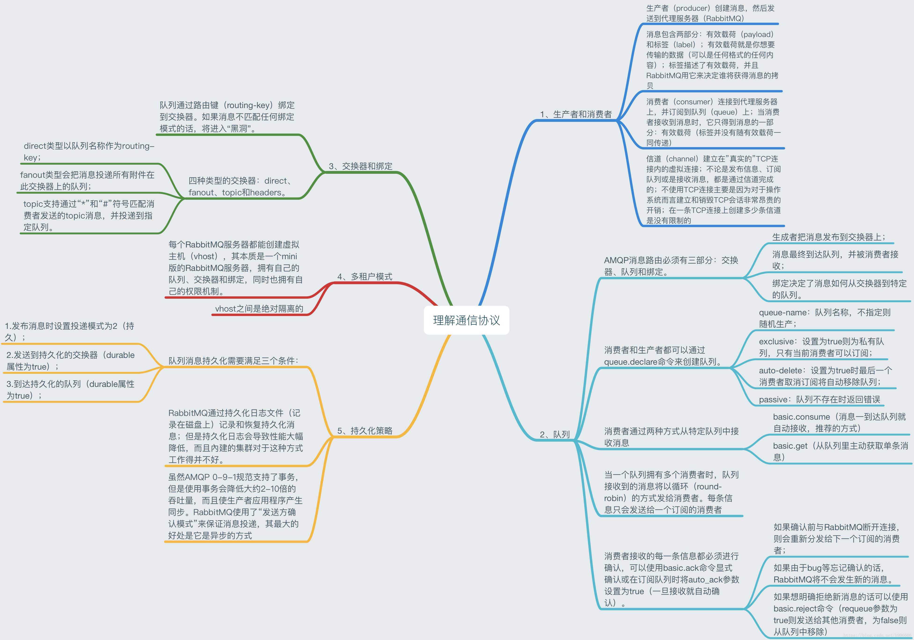
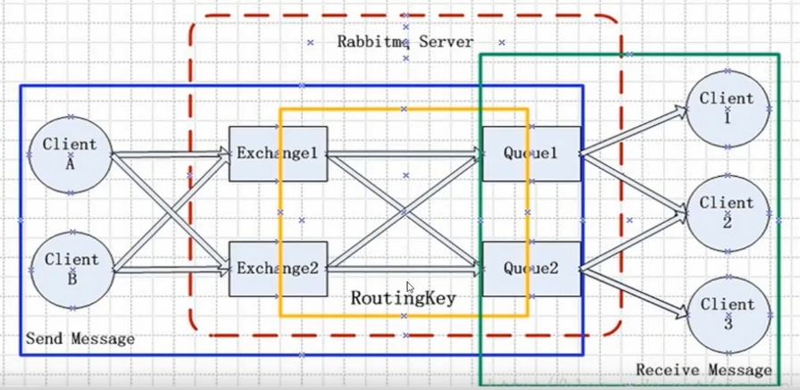
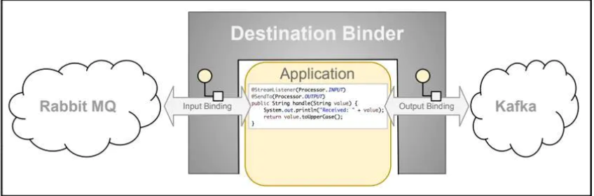
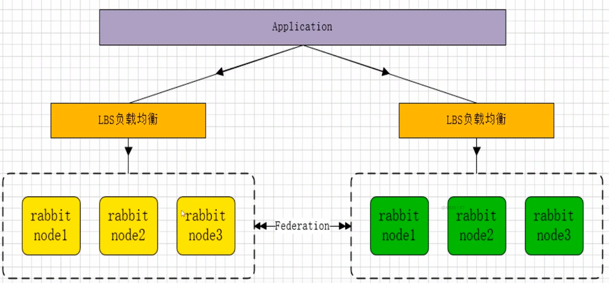
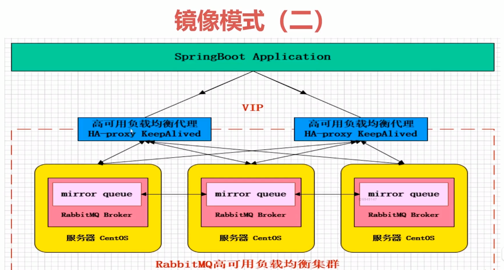
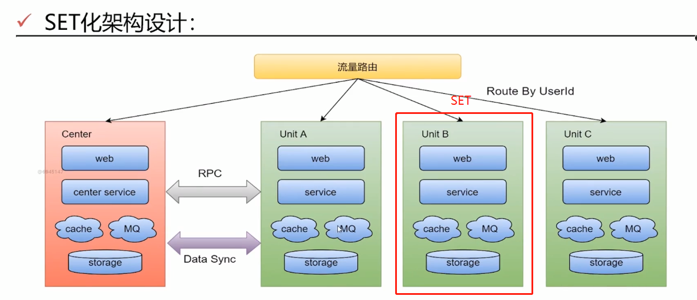

# RabbitMQ

消息中间件

市面上常用的消息中间件有：activeMQ, rabbitMQ, kafka, rocketMQ

kafka适合大数据，高吞吐量，效率极高，但是有一定的误差。

rabbitMQ中规中矩，对数据一致性、稳定性、可靠性要求很高的适用。对性能要求其次。

为什么rabbitMQ高性能的原因：Erlang语言开发，和原生socket一样的低延迟



# 安装

1. 推荐docker方式安装，官网有教程
2. 安装docker管理插件：rabbitmq-plugins enable rabbitmq_management
3. 启动服务：systemctl start rabbitmq-server
4. 查看服务状态：systemctl status rabbitmq-server
5. 重启服务：systemctl restart rabbitmq-server
6. 停止服务：systemctl stoprabbitmq-server


# 核心概念



- channel

  网络信道，类似session的概念，每建立一个连接，就代表一个channel.

- Message

  消息。有properties 和 body 组成

- virtual host

  虚拟主机。最上层的消息路由，用于逻辑隔离。

  一个virtual host里面有若干的Exchange + Queue 

  同一个virtual host里面不能有相同的Exchange 或者 Queue

- exchange

  交换机，接受消息，然后根据路由键发送消息到绑定的队列

- queue

  消息队列，存放消息。

- binding

  绑定exchange和queue

- routing key

  路由规则，虚拟机用来确定如何路由一个特定消息。


# 初级

## 消息类型

exchange类型

- direct exchange
  - 点对点通信
  - 所有发送到direct exchange的消息被转发到routing key 中指定的queue

- topic exhcange
  - 根据规则匹配分发消息，有点像direct，只不过是模糊匹配的。

- fanout exchange
  - 广播式（订阅）
  - 不管routing key是什么，只要绑定了就会推送。速度最快。

## 绑定

binding


## 消息

message = properties + body

### 其他属性

content_type 消息头

content_encoding 消息编码

priority 优先级


# 高级

## 概念与设置

### 可靠性投递

1. 确保消息**成功发出**
   1. 消息落库，对消息状态进行打标：每一条消息都做持久化存数据库，并且做标记。（性能不高）
   2. 消息延迟投递，做二次确认（重点是这个，减少了持久化操作来recheck），回调检查，如果二次确认失败则需要做补偿。
2. 确保MQ节点**成功接受**
3. 发送端收到MQ节点**确认应答**  
4. 完善的消息进行**补偿机制**

### 幂等

多次重复操作，只会成功一次。避免重复消费。

- 唯一ID+指纹码机制
  - 加版本号控制，每次操作先看版本号是否一致，一致才操作，不一致则不操作。 
  - update tableX set xx-1 ,version +1 where version = a;
  - 好处：简单
  - 坏处：需要写数据库，有写入瓶颈

- redis原子性
  - setEx(key,value);

### confirm,return

- confirm

  即consumer收到消息后反馈给producer的一种机制

  1. channel上开启确认模式：channel.confirmSelect();
  2. 在channel上添加监听：addConfirmListener，监听成功和失败的结果。然后根据结果进行处理（比如重新发送或者记录日志）

- return

  即那种投递不到的消息，需要return。对面有响应的是confirm，无响应的是return.


### 自定义消费者


消息ACK与重回队列

消费端进行消费的时候，由于业务异常可以进行日志记录，然后进行补偿；或者服务器宕机，手动ACK保障消费端消费成功。

ACK即确认消息无误；NACK代表确认消息但是消息有误。

```java
//参数1 固定的Envelope中的deliveryTag
//参数2 是否批量处理消息
channel.basicAck(envelope.getDeliveryTag(),false);
//最后一个参数代表是否重回队列。一般选择false
channel.basicNack(envelope.getDeliveryTag(),false,false);
```

重回队列：一般选择否。

### 消息限流

巨量的消息瞬间全部推送给消费端，但是无法同时处理大量的消息，所以需要限流。

措施：QOS, 服务质量保障，如果有一定数目的消息未被确认，则不进行消费新的消息。具体的数值可配置。

```java
void basicQos(int prefetchSize, int prefetchCount, boolean global) throws IOException;
//prefetchSize: 预读大小限制。默认0则不限制大小
//prefetchCount：一次性读取多少条消息。 N
//global：应用于channel上还是只应用于consumer上。
```


### TTL消息

time to live 剩余存活时间。

rabbitMQ支持定义消息过期时间，在消息发送的时候指定。

时间计算是从消息入列开始计算，只要超过了配置时间，则自动清除。（有点像redis的key  expire time）

### 死信队列

DLX： Dead-Letter-Exchange

指没有消费者进行消费的消息，会统一挪到一个队列，命名为死信队列。

产生死信的情况：

1. 消息被拒绝（basic.reject/ basic.nack ），并且requeue= false。
2. TTL过期。
3. 队列达到最大长度。

## 与spring整合

### Spring AMQP

#### RabbitAdmin

spring中注入，然后使用rabbitAdmin去声明exchange, queue, binding等（负责声明和绑定）

```java
String exchangeName = "amqpExchange";
String queueName = "amqpQueue";
String routingKey = "amqpRoutingKey";
//1.声明exchange
//new DirectExchange 默认是durable持久的
//也可以声明new TopicExchange或者new FanoutExchange..
rabbitAdmin.declareExchange(new DirectExchange(exchangeName,false,false));

//2.声明queue
rabbitAdmin.declareQueue(new Queue(queueName,false));
//3.声明binding
rabbitAdmin.declareBinding(new Binding(queueName,Binding.DestinationType.QUEUE,exchangeName,routingKey,null));

//一起声明，同上面的123 更推荐这种方式
rabbitAdmin.declareBinding(BindingBuilder
                .bind(new Queue(queueName,false))
                .to(new DirectExchange(exchangeName,false,false))
                .with(routingKey)
             );
```

#### RabbitTemplate

负责发送和接受消息

发送消息

```java
//发送消息
MessageProperties properties = new MessageProperties();
        properties.setHeader("encoding","utf-8");
        properties.getHeaders().put("desc","信息描述");
        properties.setAppId(UUID.randomUUID().toString());
        Message message = new Message("hello rabbitTemplate1".getBytes(),properties);
        rabbitTemplate.send(exchangeName,routingKey,message);

        //convertAndSend其底层还是调用的send,只不过message可以是正常的字符串 亦可以是Message对象
        rabbitTemplate.convertAndSend(exchangeName, routingKey, "hello rabbitTemplate2");
        //也可以加消息后置处理
        //rabbitTemplate.convertAndSend("amqpExchange", "amqpRoutingKey", message, new MessagePostProcessor() {
//            @Override
//            public Message postProcessMessage(Message message) throws AmqpException {
//                System.out.println("----添加额外的设置----");
//                message.getMessageProperties().getHeaders().put("desc","重置描述");
//                message.getMessageProperties().getHeaders().put("attr","额外的属性");
//                return message;
//            }
//        });
```


接受消息

```java
/*
* receiveAndConvert:相比receive多了fromMessage(response)，只拿出body部分。
* 1.如果他在前面，则拿到的是数组，
* 2.如果有receive在前面，则正常拿到的是string (根据前面的编码来)
* */

//接收到的消息是数组，默认不等待，没有消息就直接返回
Object message1 = rabbitTemplate.receiveAndConvert(queueName);
//param2:timeoutMillis 即等待多少毫秒之后无消息才返回null
//Object message1 = rabbitTemplate.receiveAndConvert(queueName, 1000);
if(message1 instanceof byte[]){
    byte[] array1 = (byte[]) message1;
    System.out.println(new String(array1));
}
//得到原生的Message对象，由body和messageProperties构成
//Message重写了toString方法
Message message2 = rabbitTemplate.receive(queueName);
System.out.println(message2);

//message.toString()重写
public String toString() {
        StringBuilder buffer = new StringBuilder();
        buffer.append("(");
        buffer.append("Body:'").append(this.getBodyContentAsString()).append("'");
        if (this.messageProperties != null) {
            buffer.append(" ").append(this.messageProperties.toString());
        }

        buffer.append(")");
        return buffer.toString();
    }
```


#### simpleMessageListenerContainer

#### simpleMessageListenerAdapter

#### MessageConverter

根据contentType的类型，决定使用哪种converter,  比如text的使用String的

- toMessage：将java对象转换为消息
- fromMessage：将消息体转换为java对象

#### 总结

大致分为5个步骤

1. 定义adapter
2. adapter设置listener方法
3. 定义converter  //可以是simple, json, jdk等等
4. adapter设置converter方法
5. container设置adapter

### Spring boot2.0

主要是配置文件+注解实现

@RabbitListener(//里面可以定义exchange, queue, binding等)

@QueueBinding

@Queue

@Exchange

```java
@Configuration
public class Consumer {
    @RabbitListener(bindings = @QueueBinding(
            value = @Queue(value = "queue-1",durable = "true"),
            exchange = @Exchange(value = "exchange-1", durable = "true",type = "topic"),
            key = "springboot.#"
        )
    )
    @RabbitHandler  //和RabbitListener绑定使用
    public void onMessage(Message message, Channel channel){
        System.out.println("消费端收到消息："+message.getPayload());
    }
}
```


### Spring cloud



#### 优势

- 异步(消息的发送方, 只需要发送一条消息出去, 就可以不管了, 至于怎处理, 则交给消息的订阅者去处理)
- 流量削峰(**宝, **东大的电商平台, 需要stream去做削峰)
- 应用解耦(发布者和订阅者相互间解耦)：生产者和消费者可以是不同的中间件，stream就好像是大家通用的管道adapter的感觉，比如任何消息都可以转换为byte[]去传输。
- 日志处理


#### Barista接口

**其思路就是提供抽象接口，实际要使用的中间件由自己决定就行。就达到了解耦的效果。**

@Output：输出注解，定义**发送**消息接口

@Input：输入注解，定义**接受**消息接口

@StreamListener：定义监听方法的注解


## 集群

### 多活模式

插件：federation

特色：

- 不需要构建Cluster，而在brokers之间传递消息
- 连接双方可以使用不同的users+virtual hosts
- 连接双方可以使用不同的rabbitMQ版本和erlang版本 




### 负载均衡

Haproxy

keepAlived


最后架构如下：




## 企业解决方案

### SET化架构

set即单元化。是为了解决大集群的问题而产生。

大集群指： 会带来一些问题，比如资源扩展、集群拆分、容灾等问题。 

#### 每一个set是一套

核心逻辑集成到一个set中，非核心的放到一个center里面。通过RPC调用。从而实现高内聚低耦合



#### 重要原则

1. 切分规则由业务层面定制
2. 优先选最大业务维度进行切分。比如O2O业务，按照用户地理位置进行切分。 


### 基础MQ消息组件设计思路

延迟消息发送：添加延迟时间，异步发送消息，增强性能。

顺序消息发送：

事务消息发送：保证消息100%不丢失

消息幂等保证：避免客户端重复消费（入库，补偿）