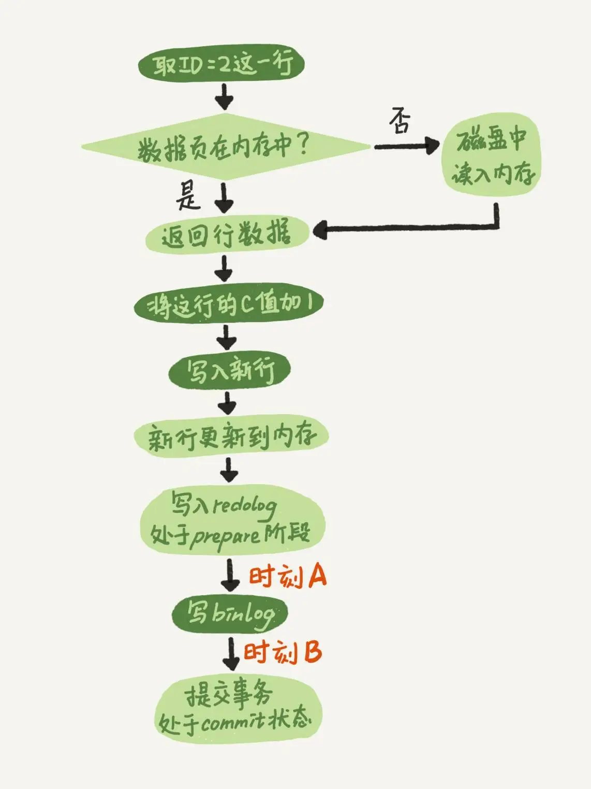
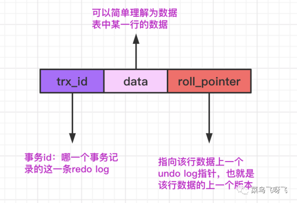
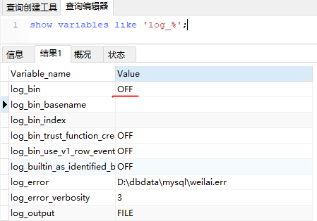
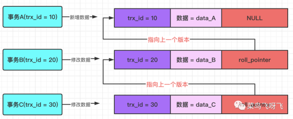
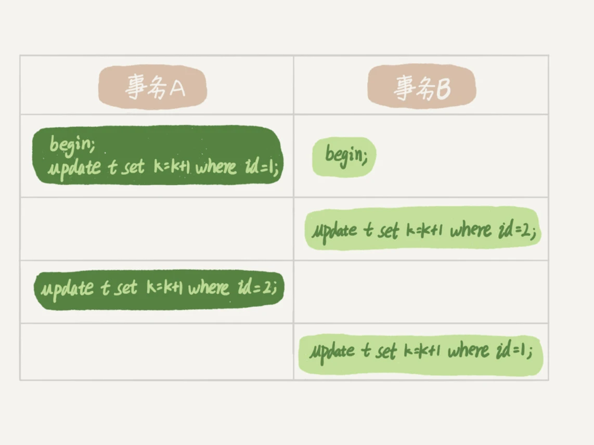
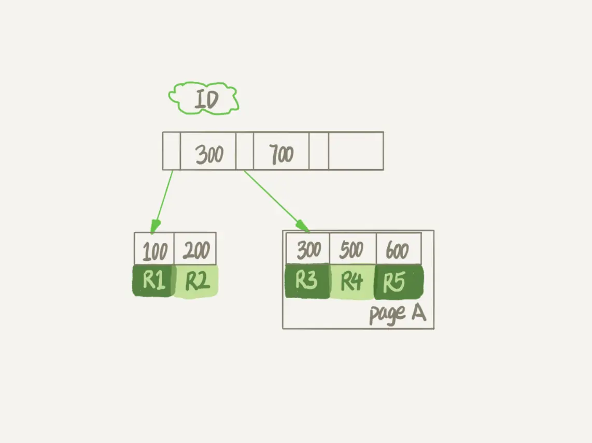

# 基础篇

注：该文档是阅读[MySQL实战45讲](https://time.geekbang.org/column/intro/139)的总结，来源如下:

[MySQL实战45讲]: https://time.geekbang.org/column/intro/139

使用到了里面的图片和文字。如有侵权，请及时联系本人删除：mailTO:gouxionglai@163.com

## 架构

MySQL 可以分为 Server 层和存储引擎层两部分。

下图是mysql的基本架构图


### 常用命令

| 命令                                                         | 说明             |
| ------------------------------------------------------------ | ---------------- |
| mysql -uroot -p123456                                        | 连接mysql        |
| show processlist                                             | 查看连接进程     |
| show variables like 'wait_timeout';                          | 超时断开连接时间 |
| show variables like 'transaction_isolation'; （show variables like 'tx_isolation';  -- 5.7以前是这个） | 隔离级别         |

### 连接器

管理连接、权限认证

### 缓存

mysql有缓存机制，key是sql语句，value即查询结果。如果命中直接返回，看似效率很高，但是有利就有弊，而且这个弊大于利，缓存失效非常频繁，只要表有更新，对于该表的所有缓存都会失效。反而增加了开销。

注意：mysql8直接去掉了该功能。

### 分析器

词法分析+语法分析

1. 解析语句，生成解析树。识别表、字段，有无语法错误
2. 检查语句中的关键词，表，字段是否存在

### 优化器

索引、表关联顺序==>确定执行计划

### 执行器

权限判断、调用存储引擎获取查询结果

## 日志系统

查询时不涉及日志，但是新增、修改、删除（统称更新操作）时，则会涉及到日志。即redo log（物理日志--临时日志）和 binlog（逻辑日志，也可叫归档日志）

update语句执行逻辑如下：



### redo log 

1、引擎层，且InnoDB特有、固定大小

2、核心是WAL 技术，WAL 的全称是 Write-Ahead Logging

3、两段式提交，即prepare,  然后写bin log,  最后 commit。两段式提交保证了事务的一致性。

### undo log

1、同名字含义，回滚用。记录了事务id(即tx_id)、更新后的数据、以及指针.(即roll_pointer，指向上一个事务。)



### bin log

1、server层

2、记录形式分为3种：statement 格式的话是记sql语句， row格式会记录行的内容，记两条，更新前和更新后都有。 

- ​	statement：-- 推荐使用row模式

```sql
-- 查看是否开启binlog
show variables like 'log_%'; 
-- 开启

```

```properties
#第一种方式:
#开启binlog日志
log_bin=ON
#binlog日志的基本文件名  指定位置
log_bin_basename=/var/lib/mysql/mysql-bin
#binlog文件的索引文件，管理所有binlog文件
log_bin_index=/var/lib/mysql/mysql-bin.index
#配置serverid
server-id=1

#第二种方式:
#此一行等同于上面log_bin三行
log-bin=/var/lib/mysql/mysql-bin
#配置serverid
server-id=1
```




### 慢日志查询

```sql
-- 慢日志记录阈值，即查询超过多少秒才记录，默认10s
SHOW VARIABLES LIKE 'long_query_time';
-- 查看是否开启慢查询 默认关闭OFF， 开启ON
SHOW VARIABLES LIKE 'slow_query_log';
```


### 举例

追问1

追问2

追问3

追问 4：如果这样的话，为什么还要两阶段提交呢？干脆先 redo log 写完，再写 binlog。崩溃恢复的时候，必须得两个日志都完整才可以。是不是一样的逻辑？


### 总结

1. redo log 是 InnoDB 引擎特有的；binlog 是 MySQL 的 Server 层实现的，所有引擎都可以使用。
2. redo log 是物理日志，记录的是“在某个数据页上做了什么修改”；binlog 是逻辑日志，记录的是这个语句的原始逻辑，比如“给 ID=2 这一行的 c 字段加 1 ”。
3. redo log 是循环写的，空间固定会用完；binlog 是可以追加写入的。“追加写”是指 binlog 文件写到一定大小后会切换到下一个，并不会覆盖以前的日志。

我个人理解的redolog作用域在于事务，两段式提交，保证的是crash-safe，崩溃的时候能保证临时的那一段的恢复。而binlog则是作用于备份恢复，是全盘的。和我们常见的日志概念最相近。


## 事务

4要素：ACID。 即**原子性（Atomicity）、一致性（Consistency）、隔离性（Isolation）、持久性（Durability）**

InnoDB引擎：支持事务，提供行级锁与外键约束

MyISAM引擎：不支持事务，不支持外键约束以及行级锁，操作时需要锁定整张表

### 事务隔离

mysql默认隔离级别是**repeatable-read 可重复读**。

| 事务隔离级别                 | 含义                                                         | 脏读 | 不可重复读 | 幻读 |
| ---------------------------- | ------------------------------------------------------------ | ---- | ---------- | ---- |
| 读未提交（read-uncommitted） | 事务读取到另外一个事务修改但未提交的数据                     | 是   | 是         | 是   |
| 读已提交（read-committed）   | 一个事务读取到了其他事务已经提交的操作。（未解决update问题） | 否   | 是         | 是   |
| 可重复读（repeatable-read）  | 事务当中，两遍同样的查询语句,不会出现在事务运行的整个过程中，不同的时间点读取到的数据不一样的情况。（update解决了，未解决insert、delete问题，会有重复插入问题） | 否   | 否         | 是   |
| 串行化（serializable）       | 读写都加锁，最安全，但是效率最低                             | 否   | 否         | 否   |

### MVCC

Multi-Version Concurrency Control，多版本并发控制

一种并发控制机制，利用一致性视图（read_view），在数据库中用来控制并发执行的事务，控制事务隔离进行。主要针对读已提交、可重复读 来实现的。



通俗说：同一个数据行，在数据库中存在多个版本号transaction id。，这个版本号可以理解为当初操作这行数据的事务的事务ID。当多个事务在并发进行的时候，判断某个事务是否可以读取到某一行时，会使用行的版本号，和当前事务的ID进行比较。

### 一致性视图

read_view  = 视图数组 + 高水位


**规则**：更新数据都是先读后写的，而这个读，只能读当前的值，称为“**当前读**”（current read）。

记住更新肯定是根据事务顺序执行。如果事务未提交就等待。因为有锁控制。

普通读没有锁，就根据MVCC规则来，只看得到视图创建前已提交的事务。

当前都有锁，会拿最新的值。

#### 视图数组

启动事务瞬间，当前正在活跃的事务trx_id。活跃指启动了还未提交。

注意：事务启动方式不同，read_view创建时间会不一样。

#### 低水位

数组里面事务 ID 的最小值记为低水位

#### 高水位

当前系统里面已经创建过的事务 ID 的最大值加 1 记为高水位。


**分析：**

1. 如果落在绿色部分，表示这个版本是已提交的事务或者是当前事务自己生成的，这个数据是可见的；

2. 如果落在红色部分，表示这个版本是由将来启动的事务生成的，是肯定不可见的；

3. 如果落在黄色部分，那就包括两种情况

   a. 若 row trx_id 在数组中，表示这个版本是由还没提交的事务生成的，不可见；

   b. 若 row trx_id 不在数组中，表示这个版本是已经提交了的事务生成的，可见。（提交了则不活跃了即从数组中移除）

**综上结论：**

- 版本未提交，不可见；
- 版本已提交，但是是在视图创建后提交的，不可见；
- 版本已提交，而且是在视图创建前提交的，可见。

#### 事务启动方式

**begin**：需要等到它之后的第一条操作innodb语句才真正开启事务（即增、删、改），同时创建transaction id.注意:快照读的时候是不分配事务id的(它只会创建一致性视图)。

**start transaction**：同上

**start transaction with consistent snapshot**：立即开启事务 ，创建read_view, 该事务肯定是数组中最后一个，所以高水位 = 当前事务+1

## 索引

目的：提高查询效率，就像书的目录。

### 数据结构

哈希表、数组、二叉树

#### 哈希表

优点：等值查询的场景，优势在于更新方便

缺点：不适合范围查询

#### 数组

优点：有序，适合静态存储，优势在于等值和范围查询

缺点：更新数据，比如在中间插入数据，需要挪动之后的每一个数据，成本太高

#### 二叉树

优点：搜索效率最高，二分查找 O(log n) 。父节点左子树所有结点的值小于父节点的值，右子树所有结点的值大于父节点的值

缺点：数深度太深，则消耗磁盘IO太久。

#### B+tree

实际在mysql中，使用的是**B+tree**。能够很好地配合磁盘的读写特性，减少单次查询的磁盘访问次数。

磁盘数据存储是采用块的形式存储的，每个块的大小为4K，每次IO进行数据读取时，同一个磁盘块的数据可以一次性读取出来。而B+tree刚好可以是多节点。所以契合。

- B+树的非叶子节点不保存数据，只进行数据索引，层级更少；
- B+树叶子节点保存了父节点的所有关键字记录的指针，所有数据地址必须要到叶子节点才能获取到。所以每次数据查询的次数都一样；
- B+树叶子节点的关键字从小到大有序排列，左边结尾数据都会保存右边节点开始数据的指针；这有利于数据库做全表扫描。
- B+树非叶子节点的子节点数=关键字数;


### 索引维护

#### 主键索引

存储整行数据，又称“**聚簇索引**（clustered index）”

#### 非主键索引

存储索引+主键的值，又称"**二级索引**（secondary index）"

#### 回表

假设ID是主键索引，k是二级索引。查询的区别是：

- 如果语句是 select * from T where ID=500，即主键查询方式，则只需要搜索 ID 这棵 B+ 树；
- 如果语句是 select * from T where k=5，即普通索引查询方式，则需要先搜索 k 索引树，得到 ID 的值为 500，再到 ID 索引树搜索一次。这个过程称为回表。

主键值越小，占用空间越小

从性能和存储空间方面考量，**自增主键**往往是更合理的选择。

#### 覆盖索引

假设ID是主键，K是普通索引

- SQL1:  select * from T where k between 3 and 5

- SQL2:  select ID from T where k between 3 and 5

SQL2这时只需要查 ID 的值，而 ID 的值已经在 k 索引树上了，因此可以直接提供查询结果，不需要回表。也就是说，在这个查询里面，索引 k 已经“覆盖了”我们的查询需求，我们称为覆盖索引。

由于覆盖索引可以减少树的搜索次数，显著提升查询性能，所以使用**覆盖索引**是一个常用的性能优化手段。

#### 联合索引

两个或更多个列上的索引被称作联合索引，联合索引又叫复合索引。

特征：**索引有序；高度较低；存储列值**

优势：避免回表；两个单列查询返回行较多，同时查返回行较少，联合索引更高效

场景：

- 等值查询中，查询条件a返回的条目比较多，查询条件b返回的条目比较多，而同时查询a、b返回的条目比较少，那么适合建立联合索引；
- 对于有等值查询的列和范围查询的列，等值查询的列建在前、范围查询的列建在后比较实用；
- 如回表的**另外**说到，如果联合索引列的前置列与索引单列一致，那么单列查询可以用到索引，这样就避免了再建单列索引，因此联合索引的前置列应尽量与单列一致；

#### 最左前缀原则

最左前缀有两层含义。1、联合索引的最左N个字段；2、字符串索引的最左N个字符 即like 'xx%'。

例如索引是key index (a,b,c). 可以支持(a)、(a,b)、(a,b,c) 3种组合进行查找，但不支持 (b,c)进行查找。当使用最左侧字段时，索引就十分有效。（包括like 'xxx%' 一样的道理 会走索引，而like ‘%xxx%’则不会走索引）

举例：

```sql
--等值查询
select * from test where a=? and b=? and c=?；--查询效率最高，索引全覆盖。
select * from test where a=? and b=? order by c；a、b、c --三列全覆盖索引，查询效率最高
select * from test where a=? and b=?；--索引覆盖a和b。
select * from test where b=? and a=?；--经过mysql的查询分析器的优化，索引覆盖a和b。
select * from test where a=?；--索引覆盖a。
select * from test where b=? and c=?；--没有a列，不走索引，索引失效。

--范围查询
select * from test where a=? and b between ? and ? and c=?；--索引覆盖a和b，因b列是范围查询，因此c列不能走索引。
select * from test where a between ? and ? and b=?；--a列走索引，因a列是范围查询，因此b列是无法使用索引。

```

总结：

使用等值查询，多列同时查询，索引会一直传递并生效。因此等值查询效率最好。

索引查找遵循最左侧原则。但是遇到范围查询列之后的列索引失效。


#### 碎片整理

对于长期未清理的表，可能存在表数据占用大小远小于索引的大小。删除了数据之后，表空间未减少等情况。此时需要进行碎片整理。

```sql
alter table table_name engine = innodb
```


## 锁

### 全局锁 

--整个数据库会处于只读状态

```txt
Flush tables with read lock
```


mysqldump

前提：InnoDB 这种支持事务的才行。因为有MVCC支持， 所以备份没问题

```cmd
mysqldump -h127.0.0.1 -uroot -p123456 --single-transaction --default-character-set=utf8 accounting_global zg_tenant_entity > /tmp/ccc.sql
```

### 表锁

元数据锁（metadata lock)。

不需要显式使用，在访问一个表的时候会被自动加上。

MDL作用是防止DDL（修改表结构）和DML（增删改数据）并发的冲突

### 行锁

针对数据表中行记录的锁。

比如事务 A 更新了一行，而这时候事务 B 也要更新同一行，则必须等事务 A 的操作完成后才能进行更新。

**注意**：如果update的列没建索引，即使只update一条记录也会锁定整张表。因为行级锁是通过锁索引记录实现的。


在 InnoDB 事务中，行锁是在需要的时候才加上的，但并不是不需要了就立刻释放，而是要等到事务结束时才释放。这个就是两阶段锁协议。

所以：建议把资源抢夺多的数据，最后来更新。减少等待时间

### 死锁

当并发系统中不同线程出现循环资源依赖，涉及的线程都在等待别的线程释放资源时，就会导致这几个线程都进入无限等待的状态，称为死锁。




### 解决死锁

- 超时自动释放锁。配置innodb_lock_wait_timeout，默认50s。 弊端：时间太长
- 主动死锁检测。配置innodb_deadlock_detect为on， 默认on。弊端：CPU消耗高，O(n^2)。
  - PS:死锁检测情况：update、delete并且有加锁操作才去检测， select不需要检测
- 解决办法：控制并发数（客户端、服务器端、数据库端）

# 实践篇

## 索引

### change buffer

本身可以持久化。是buffer pool的一部分。

**设置大小：**innodb_change_buffer_max_size， 比如50 的时候，表示 change buffer 的大小最多只能占用 buffer pool 的 50%

**作用：**缓存。要操作的数据页若在内存则直接更新，若不存在内存中，则将更新操作缓存到change buffer，而不是直接读取到内存中进行更新。

**优势：**减少读磁盘，语句的执行速度会得到明显的提升。这种方式还能够避免占用内存，提高内存利用率。

**注意：**只有普通索引才能使用change buffer, 唯一索引不能使用。因为唯一索引需要判断是否重复，要实时将数据页读取到内存，已经到内存就直接更新 ，就没必要使用change buffer了。

**Merge：**将 change buffer 中的操作应用到原数据页，得到最新结果的过程称为 merge（Purge）。

除了访问这个数据页会触发 merge 外，系统有后台线程会定期 merge。在数据库正常关闭（shutdown）的过程中，也会执行 merge 操作。

**对比：**

- redo log 主要节省的是**随机写**磁盘的 IO 消耗（转成顺序写）
- change buffer 主要节省的则是**随机读**磁盘的 IO 消耗。
- changebuffer跟普通数据页一样也是存在磁盘里，区别在于changebuffer是在共享表空间ibdata1里

### 优化器

**explain** 查看执行计划

考虑因素：1.扫描行数  2.是否使用临时表  3. 是否需要排序

```sql
-- 查看对应表索引的基数 
show index from table_name
-- 重新统计索引信息， 注意表数据变更超过总数1/10的时候会自动执行一次
analyze table t
```

### 字符串索引

创建字符串索引建议：

减少索引占用空间

1. 前缀索引。 
   1. 比如邮箱，创建alter table SUser add index index2(email(6));   //6或者其他数值应该经过业务以及统计值来决定
2. 字符串倒叙+前缀索引。
   1. 比如身份证，使用前缀就不合适，因为前6位都一样，不同的在最后面。所以存储的时候reverse一下
3. 添加hash字段+并在hash字段上加索引。
   1. 同理，避免字段值太长，计算hash值之后来减少数据量
4. 字段拆分（一个字段可拆分为两个以上）。
   1. 感觉这个 常用一些。比如身份证中取日期出来单独作为一个字段当索引。

## 脏页

内存中的数据页，InnoDB 用缓冲池（buffer pool）管理内存。

### 概念

**干净页：**内存数据写入到磁盘后，内存和磁盘上的数据页的内容就一致了，称为“干净页”。

**脏页：**当内存数据页跟磁盘数据页内容不一致的时候，我们称这个内存页为“脏页。

**LSN：**log sequence number，日志序列号。每个数据页头部都会记录LSN，每次修改都会变大。

checkpoint：我理解为校准点，标记。代表上一次刷过的点。

**由此可以判断是否脏页：**若该数据页的LSN> checkpoint的LSN，则代表是脏页。反之干净页。

ps：如果redo log刷到磁盘遇到干净页时不会再执行一次，而是直接跳过。


### 刷脏页

有以下四种情况会刷脏页，会影响mysql性能

1. redo log 写满了，要 flush 脏页。整个系统就不能再接受更新了，所有的更新都必须堵住。如果你从监控上看，这时候更新数会跌为 0。
2. 内存不够用了，要先将脏页写到磁盘。
   1. 影响读（查询时长）——脏页淘汰数目过多，产生内存抖动
   2. 阻塞写——redolog过小，写满会阻塞写
3. MySQL 认为系统“空闲”的时候刷脏页
4. MySQL 正常关闭的时候，会把内存的脏页都 flush 到磁盘上

其中1、2这两种应该尽量避免

脏页刷新至硬盘过程如下：


### 策略

mysql参数设置，以前机械磁盘性能差，瓶颈是磁盘的 IOPS，但是目前大部分都是ssd，性能好

```mysql
show variables like 'innodb_max_dirty_pages_pct';
-- 磁盘io能力，默认200，如果是ssd则建议设置为20000
SET GLOBAL innodb_io_capacity = 2000;
-- 
SET GLOBAL innodb_io_capacity_max = 20000;	
-- 是否连带更新附近的脏页，如果脏页过多也会影响性能。所以mysql8.0默认是0，以下默认是1
SET GLOBAL innodb_flush_neighbors
```


## 空间占用

```sql
-- 表数据存放 
-- on 单独存放， 每个 InnoDB 表数据存储在一个以 .ibd 为后缀的文件中。MySQL 5.6.6之后默认on
-- off 表的数据放在系统共享表空间，也就是跟数据字典放在一起
show variables like 'innodb_file_per_table';
-- 删除语句，只是把该记录标记为可复用。
delete from tableA where id = xxx;
```

delete 命令其实只是把记录的位置，或者数据页标记为了“可复用”，但磁盘文件的大小是不会变的。这些可以复用，而没有被使用的空间，看起来就像是**“空洞”**

insert也有可能造成“空洞”。如果数据是随机插入的，就可能造成索引的数据页分裂。

综上：经过大量增删改的表，都是可能是存在空洞的。所以，如果能够把这些空洞去掉，就能达到收缩表空间的目的。而重建表，就可以达到这样的目的。

### 记录复用

记录的复用，只限于符合范围条件的数据。只有在范围内的数据才可以使用。

### 数据页复用

整个数据页可复用，其他数据也可以使用。

比如：



​	比如上面的这个例子，R4 这条记录被删除后，如果插入一个 ID 是 400 的行，可以直接复用这个空间。但如果插入的是一个 ID 是 800 的行，就不能复用这个位置了。

​	但是如果是R4整个数据页都删除，那ID是800的数据是可以使用的。